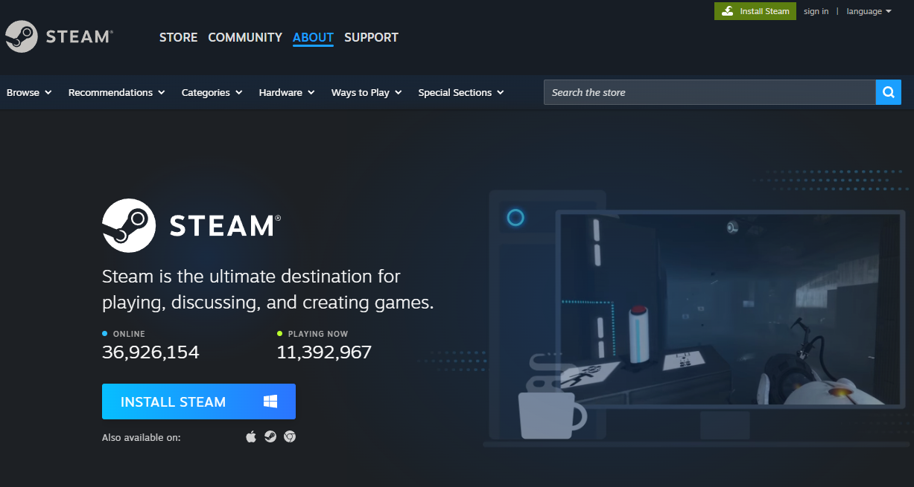
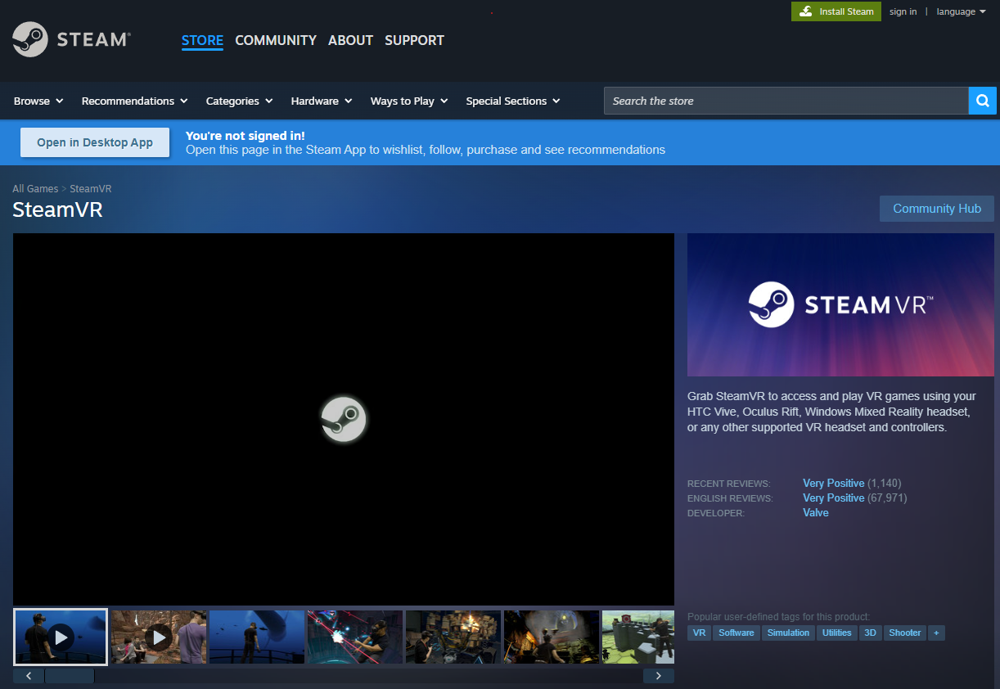
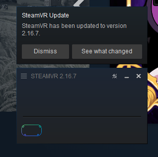
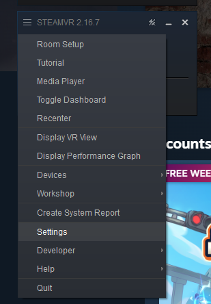
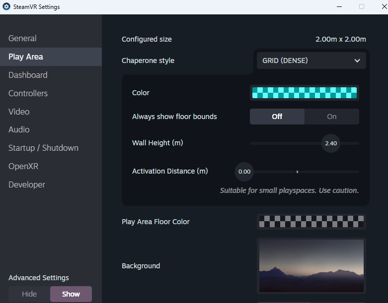
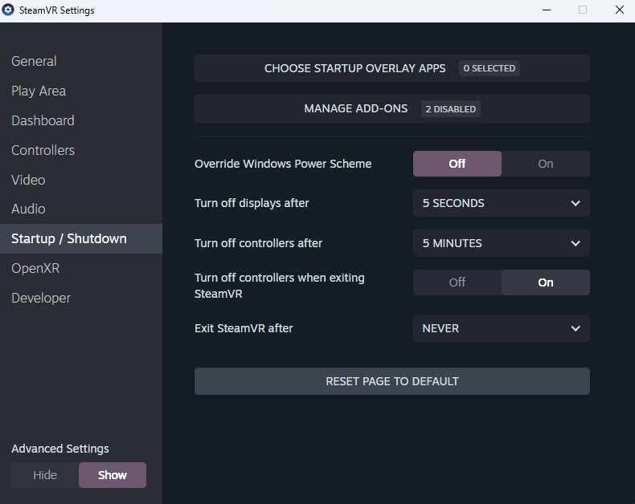
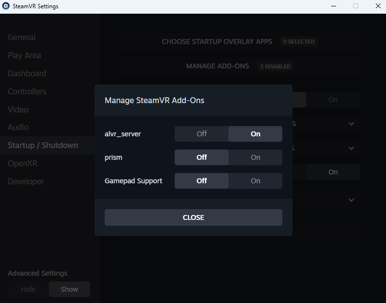
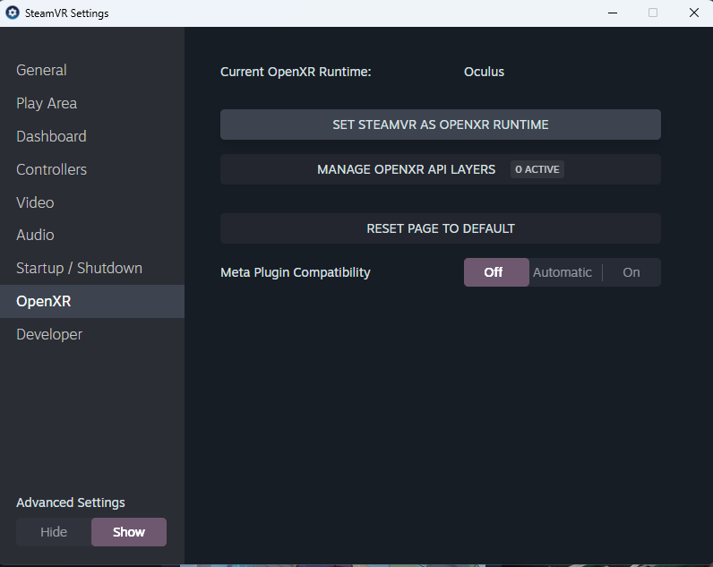

# Install and Connect to Steam

https://store.steampowered.com/

## Install SteamVR

Install the **SteamVR** app from the Steam Store.

https://store.steampowered.com/app/250820/SteamVR/

## Can a Steam Machine Run VR?

Maybe. I think Valve is still working on it.

It probably won't be able to run demanding Unreal Engine games with high graphics settings, but it may be suitable for lightweight VR experiences in the future.

https://store.steampowered.com/hardware/steammachine

## Can I Build a VR PC with SteamOS?

Yes, but for now you'll need to choose compatible hardware carefully.

---

If you have installed SteamVR, you should see something like this:

## Open the Settings

Let's open the **Settings** menu.

Have fun exploring and customizing SteamVR!

For this guide, however, we're interested in **OpenXR**.

Use this menu to manage applications such as **ALVR**, which you'll install in the next step.

Now let's tell your computer to use **SteamVR** instead of **Meta Horizon (Oculus Setup)** as the default OpenXR runtime.

This is a newer tool that can simulate Meta hardware in Steam, but we won't use it in this guide.

From now on, launching a VR game on your computer will automatically start SteamVR.

## You Still Need a SteamVR-Compatible Headset

To play, you'll need a headset that is compatible with SteamVR.

One of SteamVR's biggest strengths is that it is very open. You can even build your own headset and connect it through the SteamVR API.

For example, **RiftCat** lets you use a phone and Google Cardboard as a VR headset:
https://riftcat.com/ 🐈👓

For this guide, we'll use **ALVR** instead.

ALVR turns compatible Android XR headsets—including the **Meta Quest 3**—into SteamVR-compatible headsets, allowing you to stream PC VR games wirelessly.

See you in the next step.
