Go here and download:
https://github.com/alvr-org/ALVR

Go on ALVR
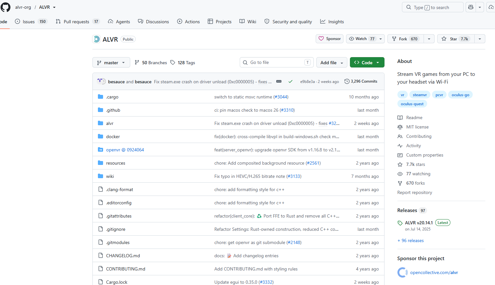

Release Window
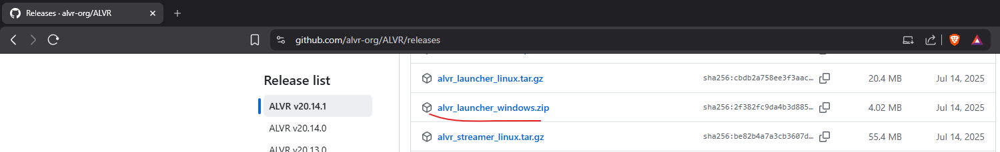

Extract the installer
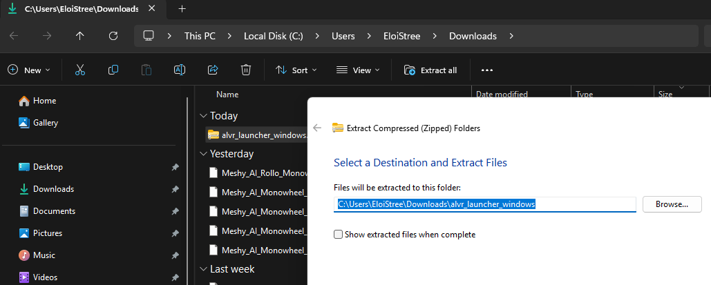

Execute the launcher and install the version
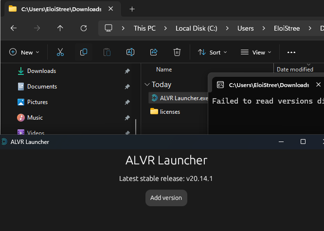

ALVR is on the Quest3 Store so no need here.   
But if you want, you can install APK of ALVR if you have a Quest in developer mode and know how to use USB Debug and accept device authority.
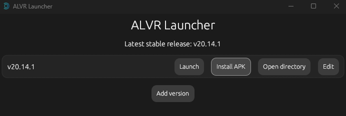

Launch ALVR, the wizard is waiting you🧙‍♂️.

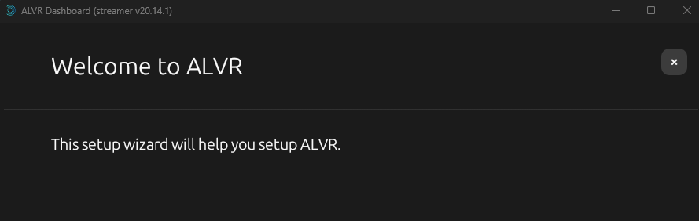

Reset setting
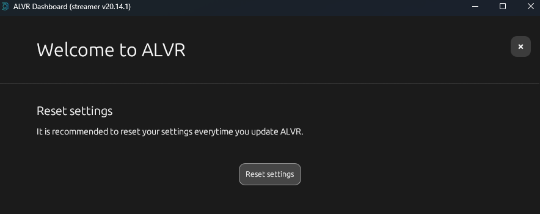

ALVR works with low graphic card but you should not use it on such.
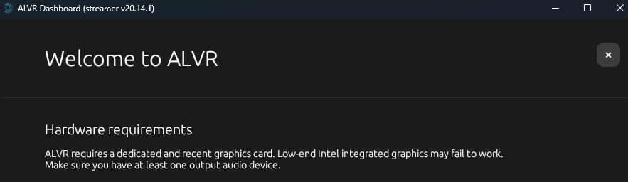

If you need sound, I dont install it to avoid to much software on my PC.
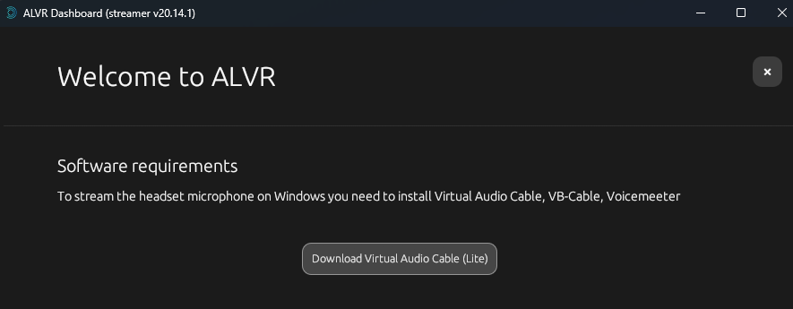

If you dont disable firewall you need to create a hole in your network port for ALVR
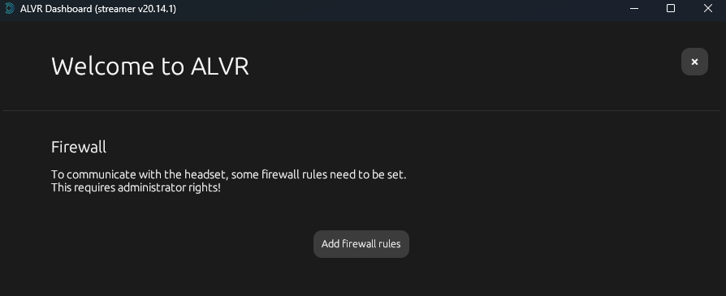

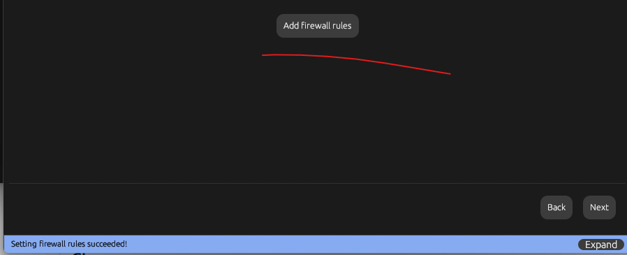

ALVR is ready and installed.
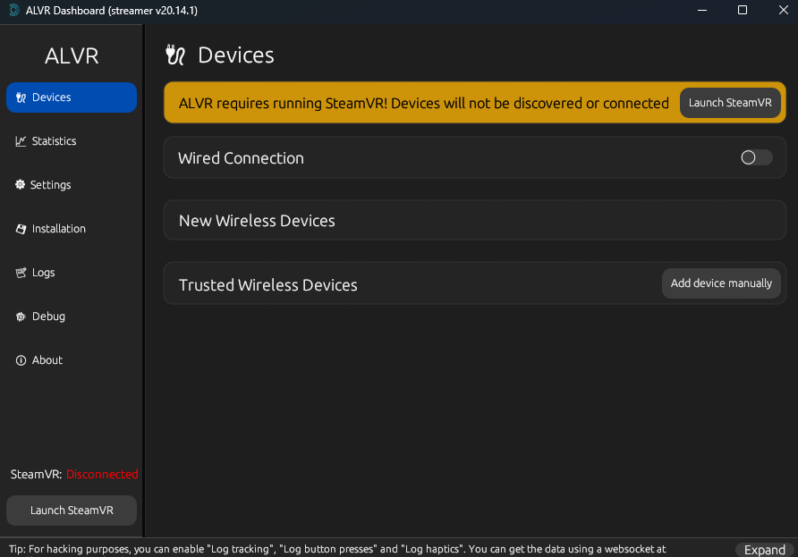

For the next part:
- You need to have installed Steam VR and setup it up as Open XR entry.
- Create a Wifi Hostspot for your device.
- Have the Quest on the wifi of your computer
- Installed ALVR on your Quest3
  