If you don't have a developer headset, you can install ALVR from the Meta Store.  
  
[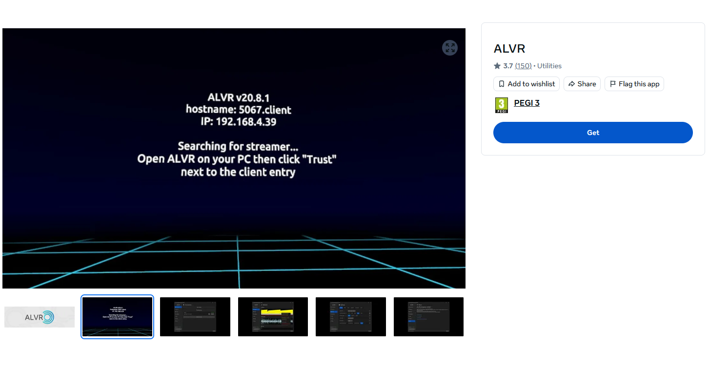](https://www.meta.com/en-gb/experiences/alvr/7674846229245715/?srsltid=AfmBOopPVGRvDa_7YtnrZf8v6XsKe9FqQ4F1kp_R3hVU9uwIeKFgl0Ab)  
  
https://www.meta.com/en-gb/experiences/alvr/7674846229245715/  
  
However, if you are using a Lynx XR, Android XR, or any alternative to the Quest 3, you will need to install the APK manually.  
  
## Prerequisites  
  
> These steps are not explained here because they are standard. There are many tutorials on YouTube, and if you are attending my workshop, we already completed them together.  
  
- Create a Meta Developer Account.  
- Enable Developer Mode on your Quest.  
- Connect your Quest via USB and authorize the connection when the popup appears.  
  
## Install Scrcpy  
  
Go to the Scrcpy GitHub repository.  
  
[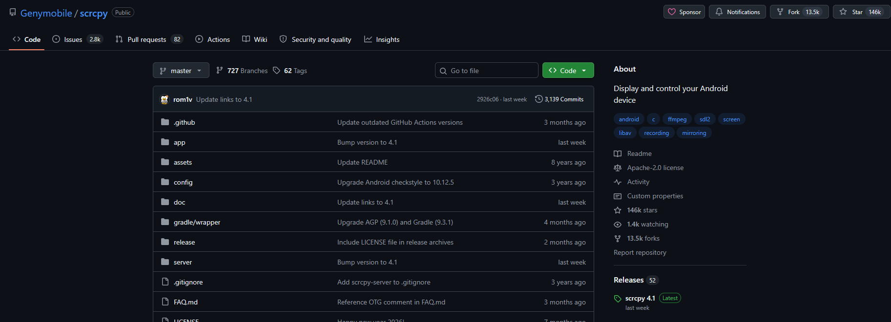](https://github.com/Genymobile/scrcpy)  
  
https://github.com/Genymobile/scrcpy  
  
Open the **Releases** page.  
  
  
  
Download the Windows 64-bit version.  
  
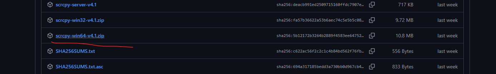  
  
I extracted it to my `C:` drive:  
  
`C:\Exe\scrcpy`  
  
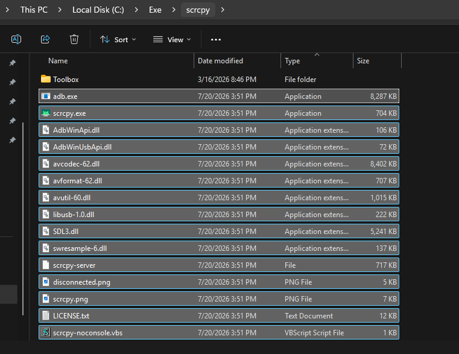  
  
As a bonus, I also copied my toolbox into the same folder:  
  
https://github.com/EloiStree/2025_01_12_pyhton_build_run_apk_broadcaster  
  
```bash
git clone https://github.com/EloiStree/2025_01_12_pyhton_build_run_apk_broadcaster.git toolbox
```
  
It contains several `scrcpy` and `adb` commands to communicate with Android phones and Quest headsets.  
  
For example, open a Command Prompt and run:  
  
`adb devices`  
  
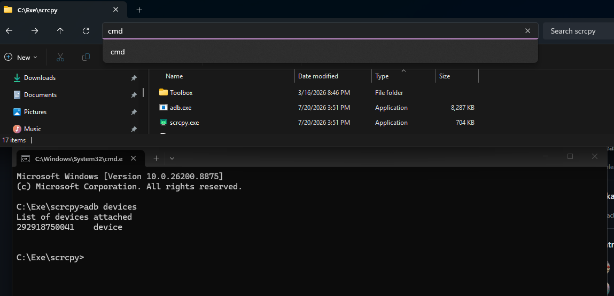  
  
This displays the connected Android devices.  
  
You can also request more detailed information by specifying the device with `-s` and using `-l` to list additional details.  
  
```bash
adb -s 292918750041 devices -l
```
  
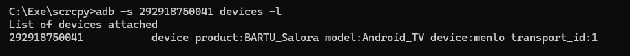  
  
If only one Android device is connected, you can simply double-click `scrcpy.exe`.  
  
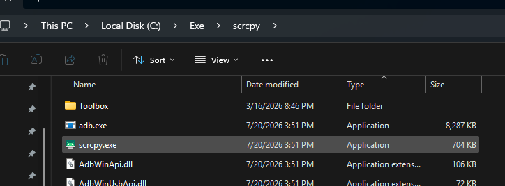  
  
You should see your phone's screen.  
  
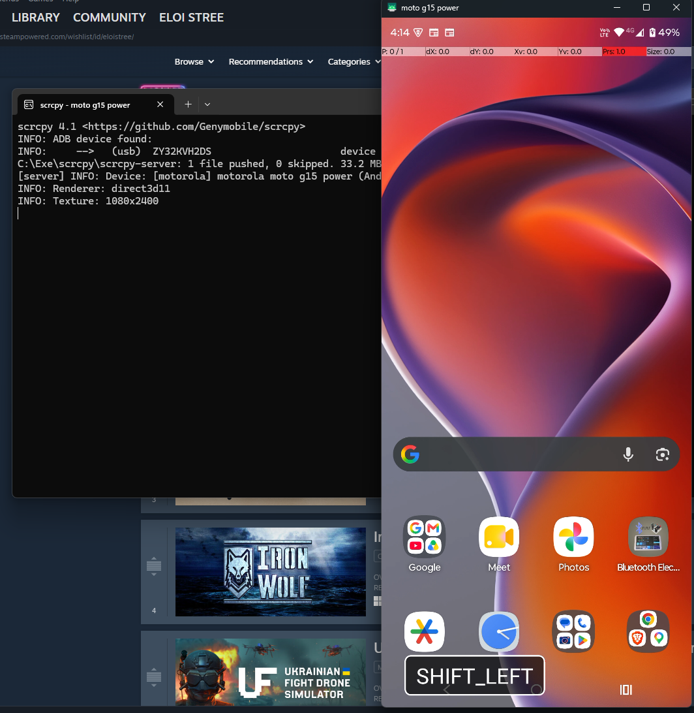  
  
## Download the APK to Install  
  
Download ALVR from GitHub:  
  
https://github.com/alvr-org/ALVR/releases/tag/v20.14.1  
  
Download the APK.  
  
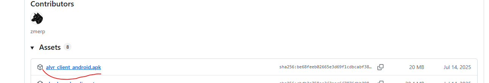  
  
Then drag and drop it onto your Quest 3 screen in Scrcpy.  
(Here I'm using my phone because my Quest wasn't nearby.)  
  
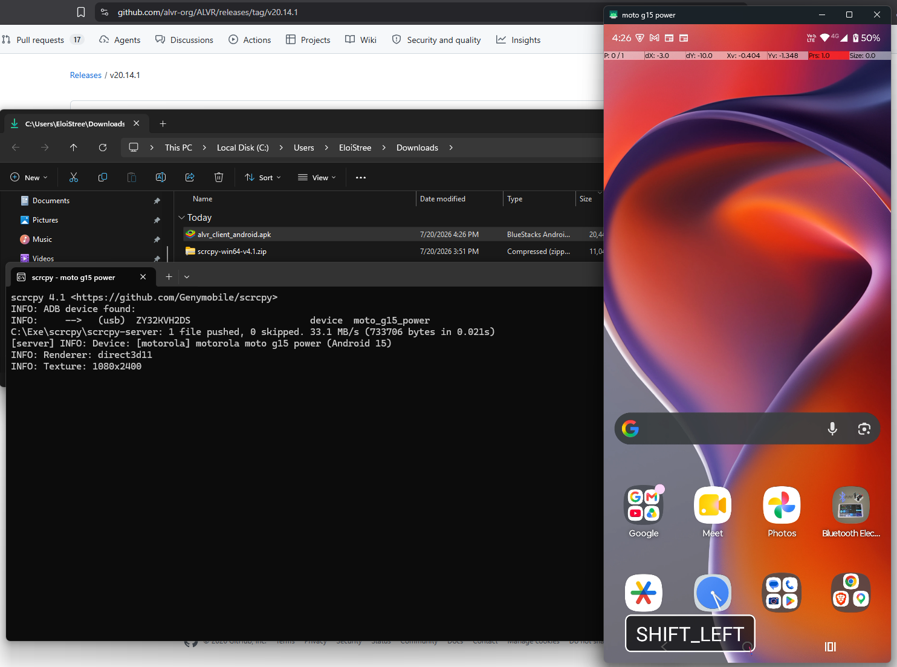  
  
Do the same for F-Droid and MRTK/XRTK/VRTK.  
  
[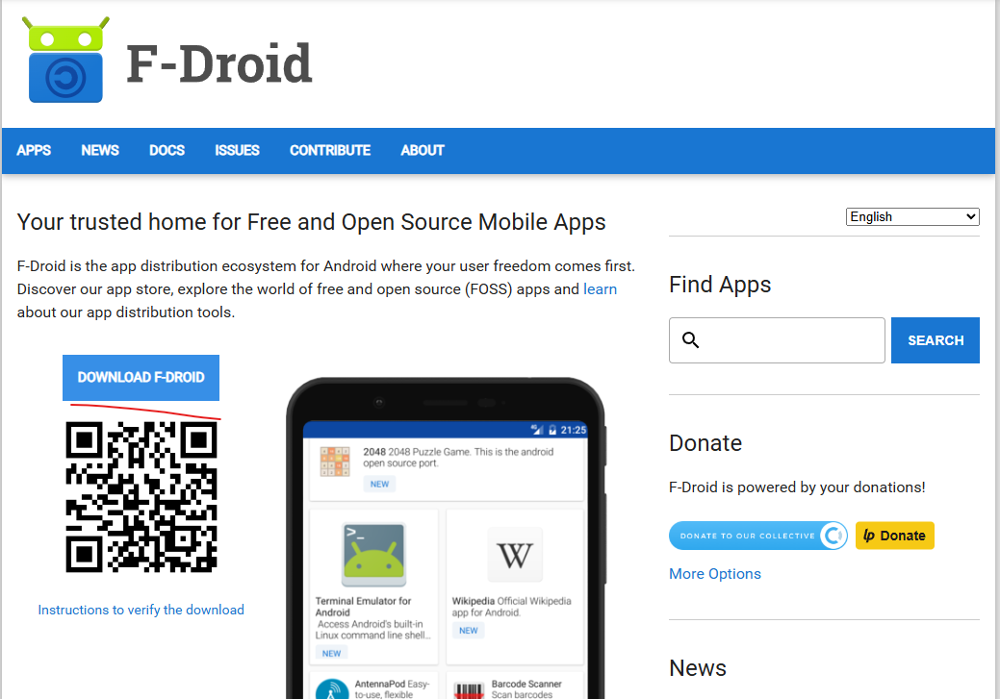](https://f-droid.org/en/)  
  
https://f-droid.org/en/  
  
[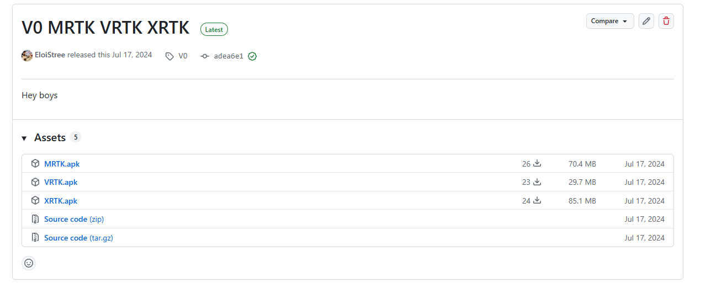](https://github.com/EloiStree/2024_07_16_workshop_mons_xr_design/releases/tag/V0)  
  
https://github.com/EloiStree/2024_07_16_workshop_mons_xr_design/releases/tag/V0  
  
ALVR can work over a wired connection, while Steam Link only works over a local Wi-Fi network.  
  
You can also connect your headset to your Wi-Fi hotspot if needed.  
  
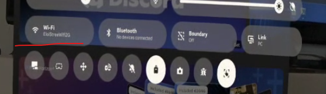  
  
As a reminder:  
  
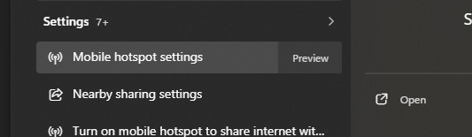  
  
Don't forget to set an easy password for your VR hotspot and disable power saving, otherwise the hotspot may turn off every 10 minutes.  
  
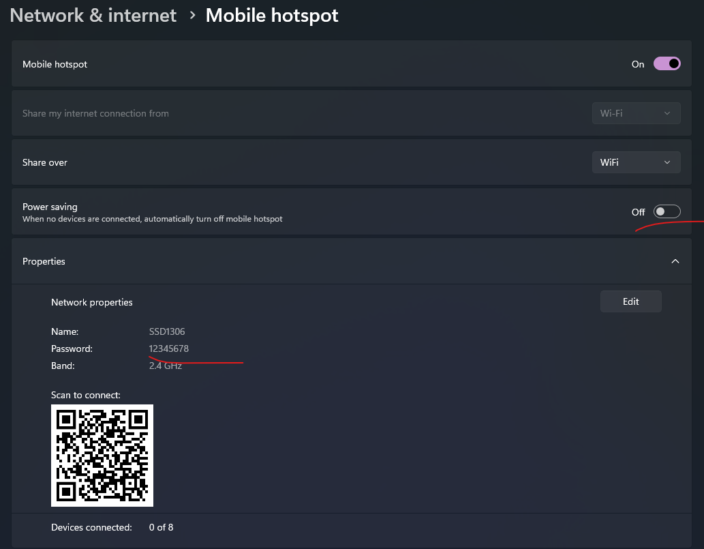  
  
## Launch a Manually Installed APK  
  
If you installed an APK manually, open **Applications**.  
  
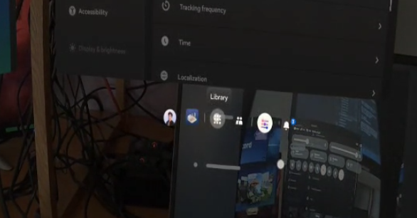  
  
Then open **Unknown Sources**.  
  
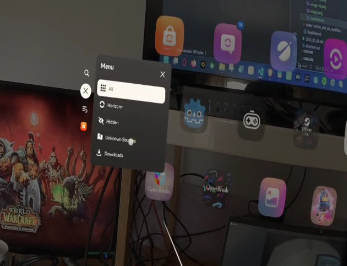  
  
Find **ALVR**, **F-Droid**, or any other manually installed application.  
  
Note that most standard Android APKs also run on the Quest.  
  
For example, this thermal camera application:  
  
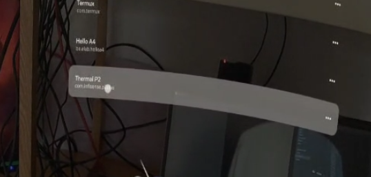  
  
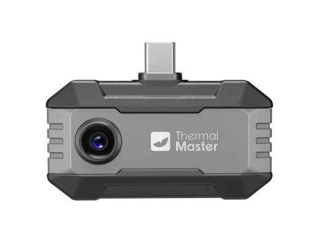  
  
Once you launch ALVR, you should see this menu.  
  
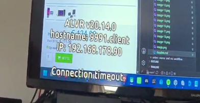  
  
Select **Wired Connection** and trust the device for future connections.  
  
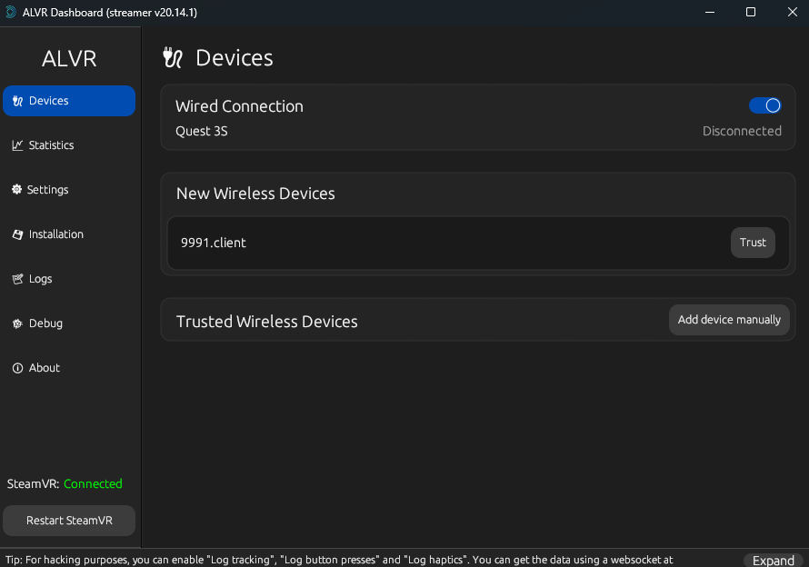  
  
Launch SteamVR if it was not started automatically by ALVR.  
  
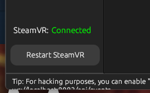  
  
You can also request to see the headset's view.  
  
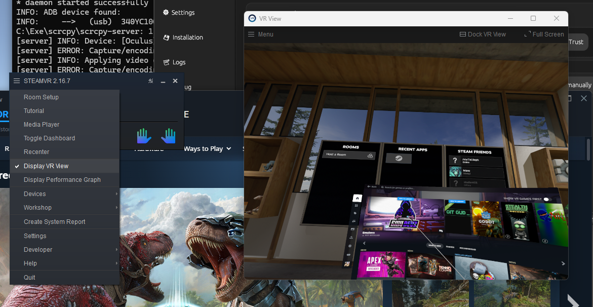  
  
If you've reached this point, congratulations! You have successfully installed ALVR on Windows using Scrcpy, and you're ready for some SteamVR adventures with OpenXR on your device. 😜  
  
Note that SteamVR also supports hand tracking.  
  
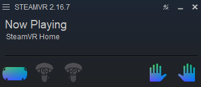  