I skipped the account creation and Unity installation.

You can create a **Mixed Reality** project if you plan to relocate the board into the real world.

Or choose **Quick VR** if you plan to make a game that doesn't use the camera.

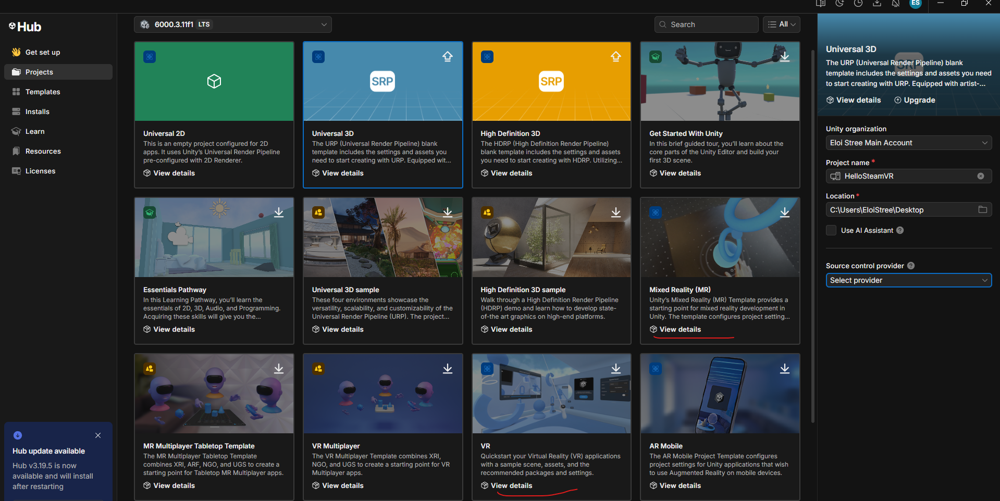

In my Chess solution, I used **Mixed Reality**, but since I'm curious, I'll use **VR** here.

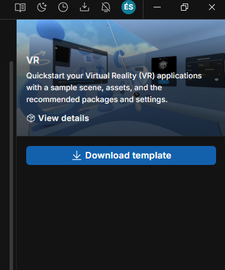

Install the Android module.

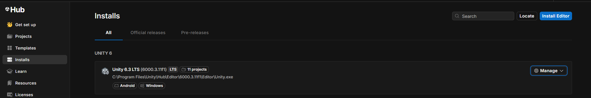

Don't forget to install **OpenJDK** and the **Android SDK/NDK**.

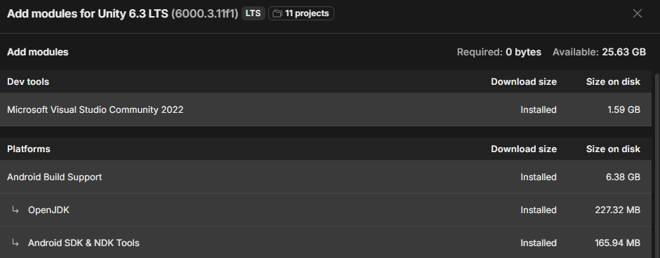

Also install **IL2CPP** if you plan to publish your project for the Quest 3.

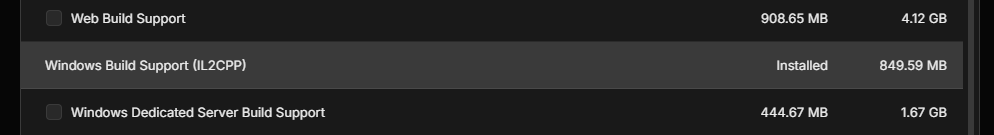

---

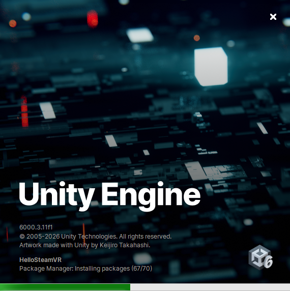

> **Scratch Break:** Create a small game while Unity loads. 😜
> https://scratch.mit.edu/projects/editor/?tutorial=getStarted

---

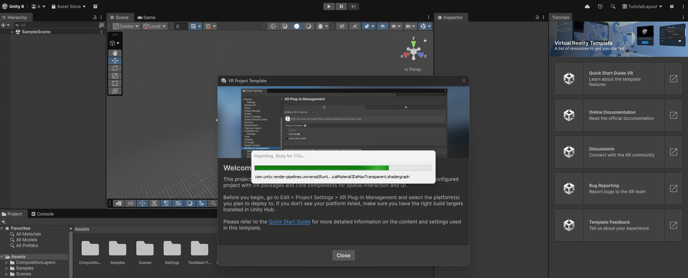

**Official Tutorial:**
https://docs.unity3d.com/Packages/com.unity.template.vr@9.2/manual/index.html

It uses the **XR Interaction Toolkit**:
https://docs.unity3d.com/Packages/com.unity.xr.interaction.toolkit@3.5/manual/index.html

**Official Step-by-Step Guide:**
https://docs.unity3d.com/Manual/xr-create-projects.html

**About XR Origin:**
https://docs.unity3d.com/Manual/xr-origin.html

**How to Grab Objects:**
https://docs.unity3d.com/Packages/com.unity.xr.interaction.toolkit@3.5/manual/xr-grab-interactable.html

---

You should now be standing in front of a demo scene.

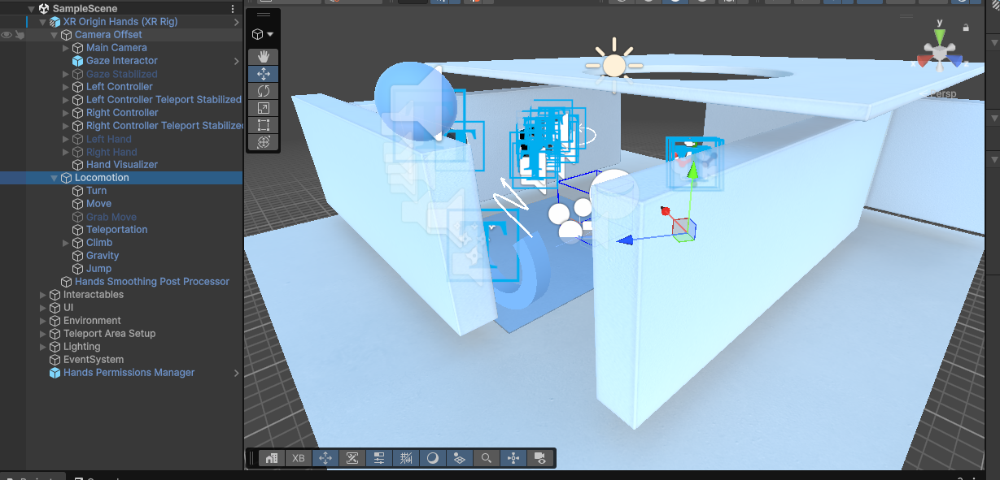

Check that **ALVR** and **SteamVR** are running.

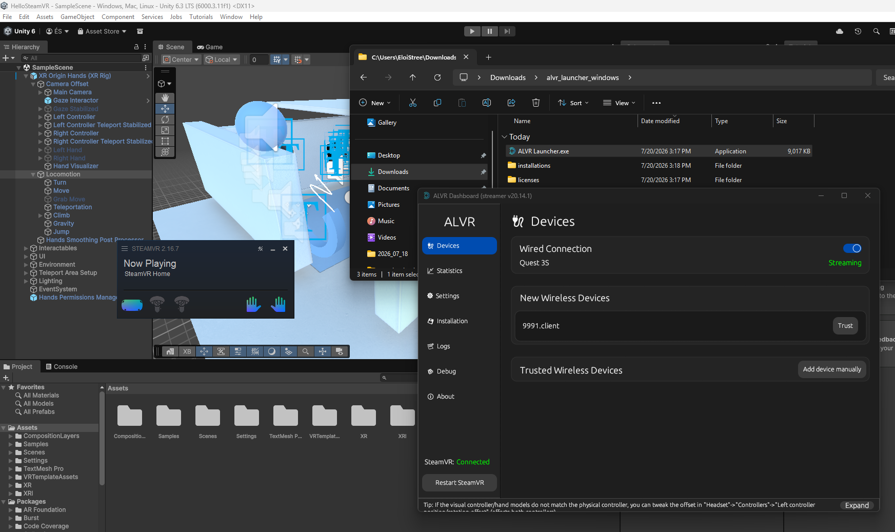

Press **Play** and try the demo to verify that it works correctly on your computer.

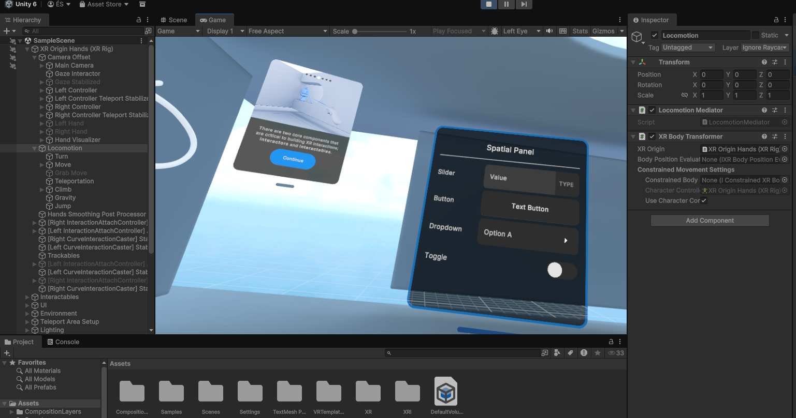

As a "Hello, World!" example, let's make a grabbable cube.

Add a cube to your scene.

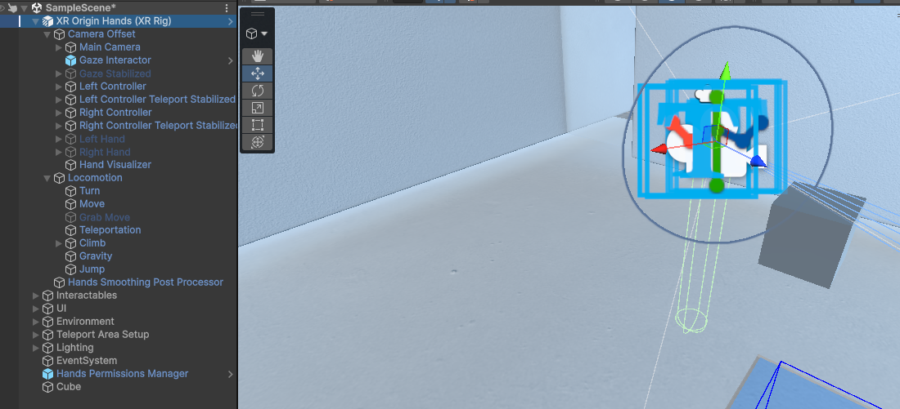

Make it grabbable.

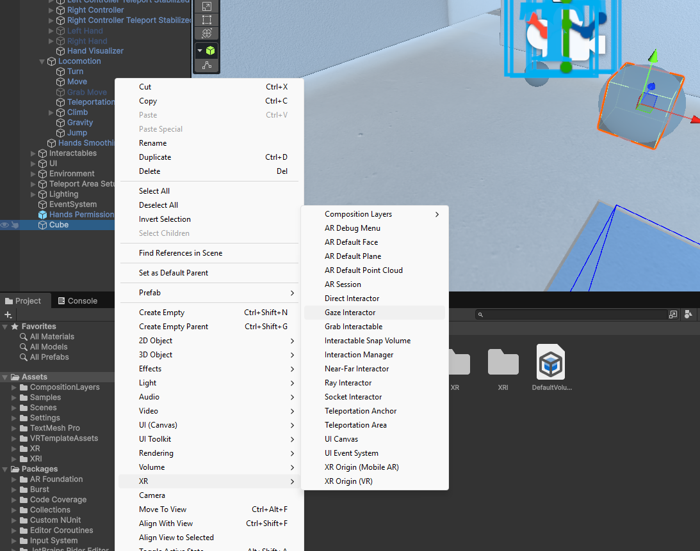

Add the cube to the **Grab Rigidbody** list.

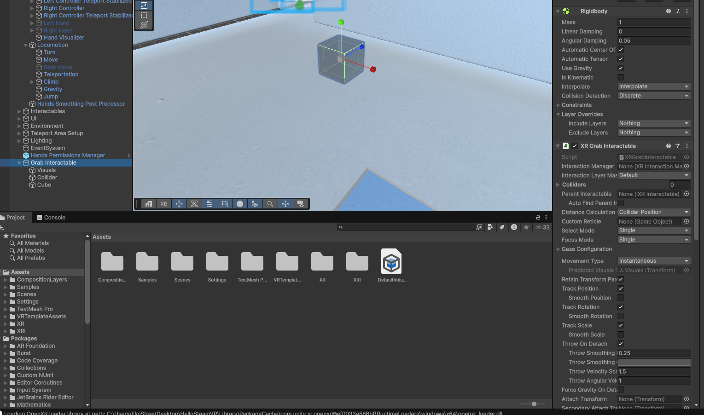

Tadaaa!

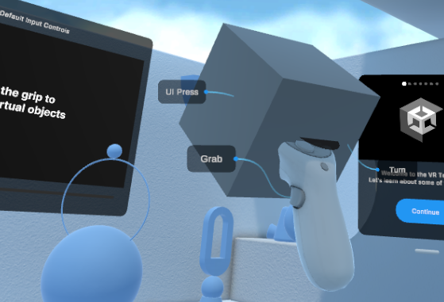

Now comes the hard part for me—which should be easy for you: **RTFM**. 😄

* I learned **VRTK 2016** → It was discontinued.
* I learned **MRTK** → It was discontinued.
* I learned the **OVR Toolkit** → It was discontinued.
* I learned **VRTK 2018** → It was discontinued.
* I learned **OpenVR** → It was discontinued.
* I tried the **Meta SDK** → I don't like it.
* I tried the **XR Interaction Toolkit** → It's good, but I'm tired of relearning everything.

VR has changed every six months for the past 12 years, requiring developers to rebuild their toolboxes almost every time.

During COVID, the **XR Interaction Toolkit** and **OpenXR** became widely adopted, and fortunately they have been much more stable. 😋

I'm planning to relearn the Godot XR tools, but not Unity's XR ecosystem. So I can't really help you beyond this point.

----------------

We could continue here, but our aim is to learn Mirror.   

Learn Mirror in VR means lose some time in build and XR...   

We will train on a empty 2D Android phone project first.  

