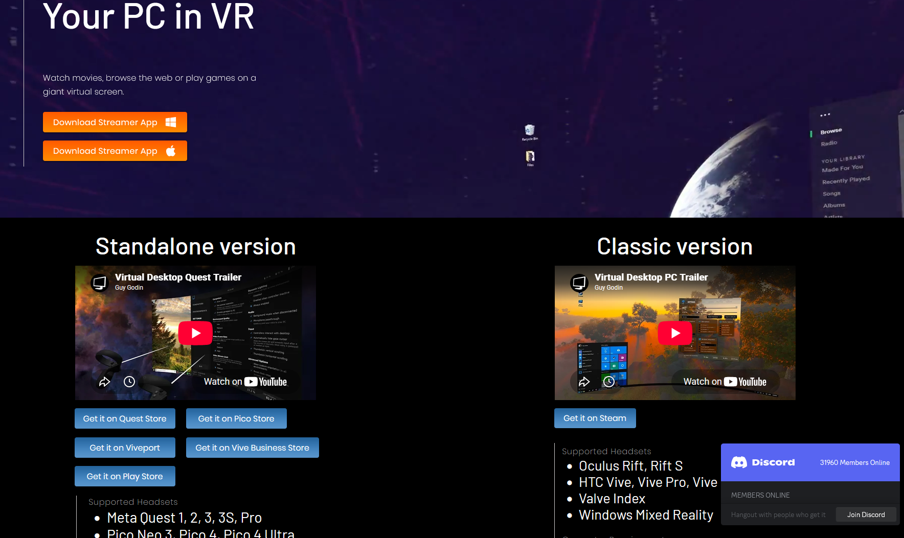
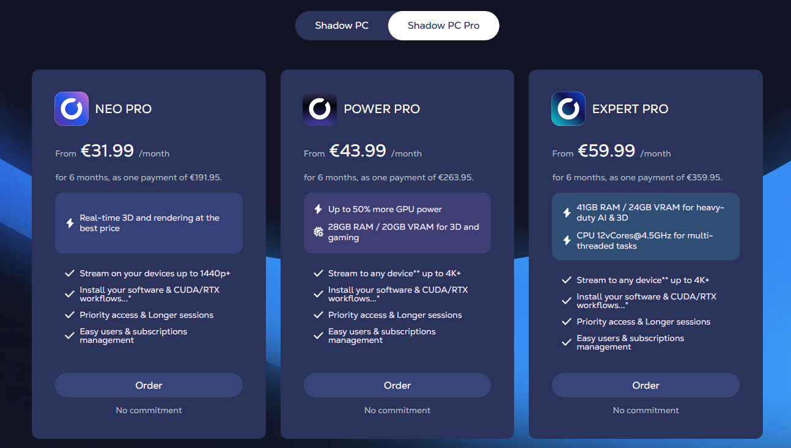
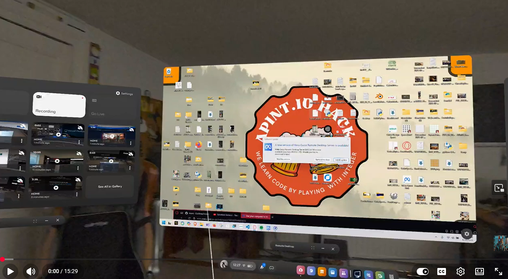
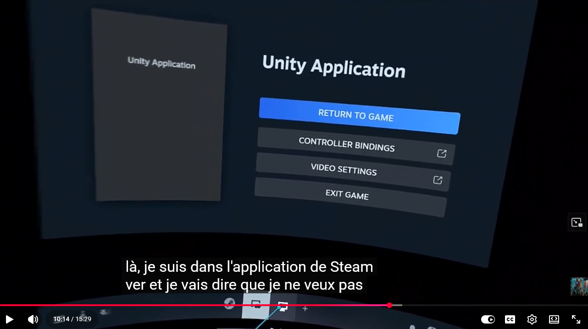
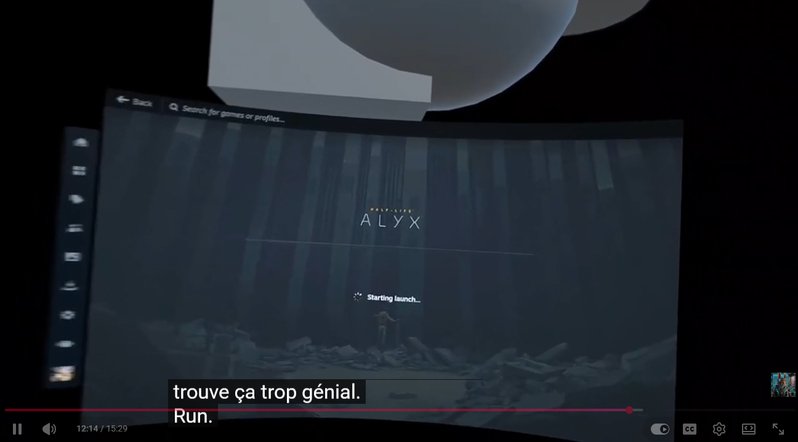
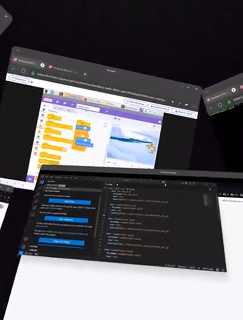
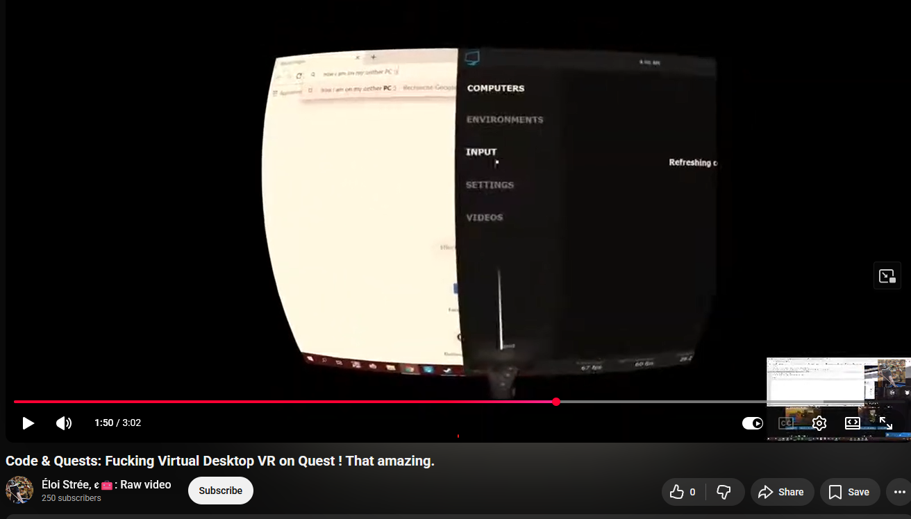

[ALVR](https://github.com/alvr-org/ALVR) is very good for low-end computers.  
And [Steam Link](https://steamcommunity.com/app/353380?l=dutch) is simple to use.

But [Virtual Desktop](https://www.vrdesktop.net/) **is the best**.  

https://www.vrdesktop.net/

If you're only doing VR, it's the best option.

Its biggest selling point is that you can use it with your PC at home over the internet if you configure port forwarding correctly.

You can also host a VR game on Shadow PC if you need to work on a project and don't have a powerful computer. It costs about $75/month.

## Cons
- It costs around $40: about $20 for the Quest app and $20 for the PC version on Steam.
- Only works with Windows PCs as the host.

--------------

I invite you to test it yourself.

https://youtu.be/laU5LFUxhbk?t=614

https://youtu.be/laU5LFUxhbk?t=744

  
https://youtu.be/UNRGSQ8Qkh8?t=150

