# Before Learning Mirror

Before learning **Mirror**, I would like to teach you a bit about the basic principles of networking.

For this, we need:

* An empty Unity project with **Mirror** (we will use it later).
* Two utility packages.
* **Tick** lets you quickly use Unity Events for keyboard input, `Awake`, and coroutines.
* **UDP Thread In Out** lets you create UDP servers inside Unity without the usual complexity, making it great for rapid prototyping.

---

# Create an Empty Project

Create a new empty project called **HelloNetwork**.

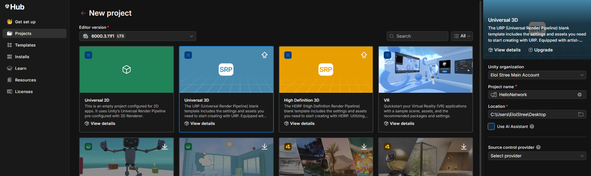

---

# Add Mirror

Add **Mirror** from the Unity Asset Store.

[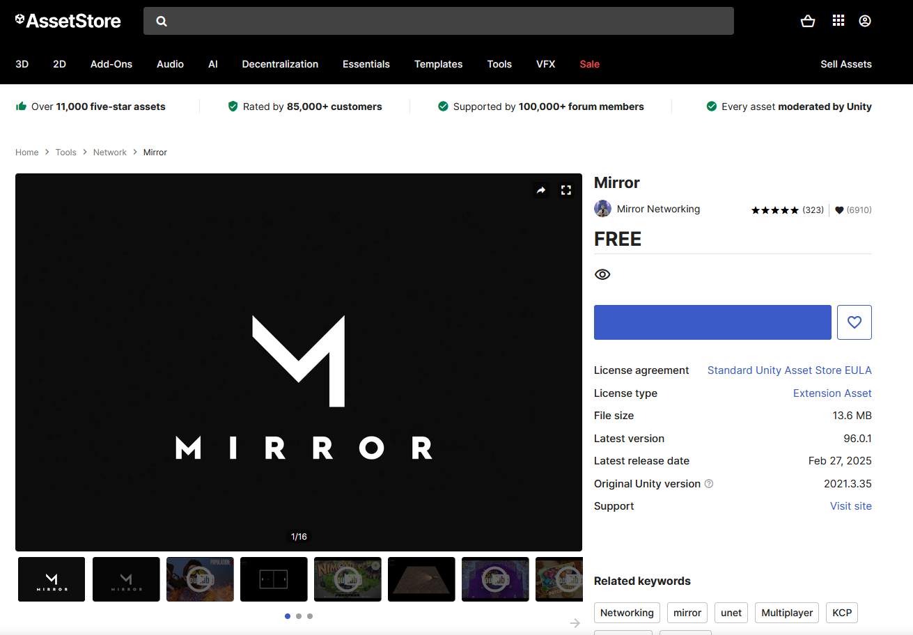](https://assetstore.unity.com/packages/tools/network/mirror-129321?srsltid=AfmBOoqjT5fVljC2LWgh9bBGEgkcsVW932nQ_bKov_ff5Kq2BdxYBs0)

[https://assetstore.unity.com/packages/tools/network/mirror-129321](https://assetstore.unity.com/packages/tools/network/mirror-129321)

Mirror is still an open-source project if you want to follow its development on GitHub.

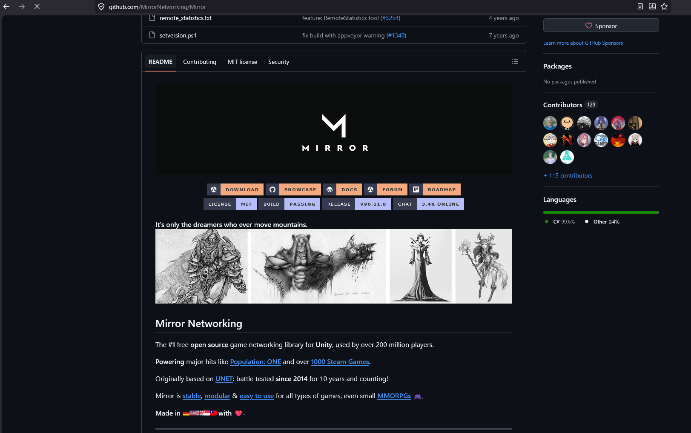

Mirror is now available in your project's **Assets**.

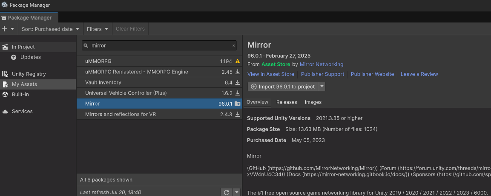

Import it and let Unity install everything.

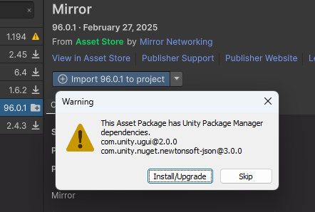

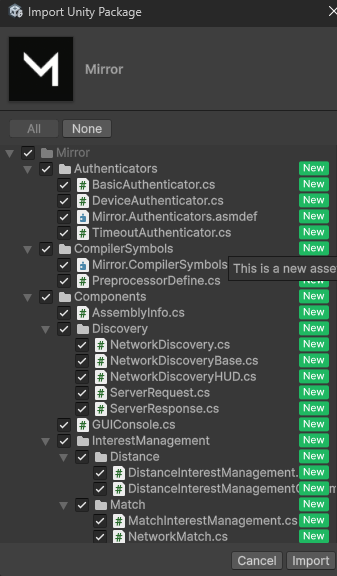

---

# A Brief History of Mirror

To briefly summarize Mirror's origins:

Mirror is based on **UNet**, a networking technology originally created by Unity. Unity eventually decided to discontinue it.

The Mirror developers basically said:

> "But... we like it. It's simple, and it works."

So they continued developing it as an open-source project.

---

# Open the Basic Demo

Open the **MirrorBasic** scene to understand the basics of Mirror before we start building our own networking systems.

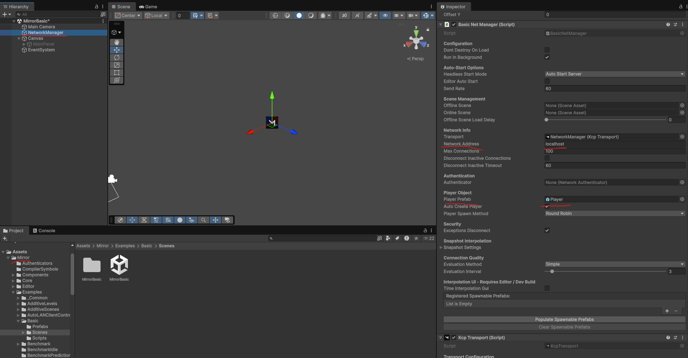

The `NetworkManager` component is responsible for managing the server and connected players.

To use it, you need to create a **Player Prefab** and assign it to the **Player Prefab** field.

You can also prefill the server address using the **Network Address** field instead of using `localhost`.

When you press **Play**, this basic menu appears.

If you are the first player, start the server as a **Host**.

Otherwise, connect as a **Client**.

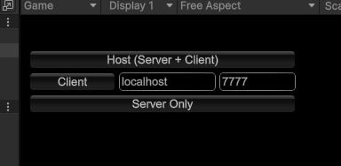

Mirror then creates an instance of your player.

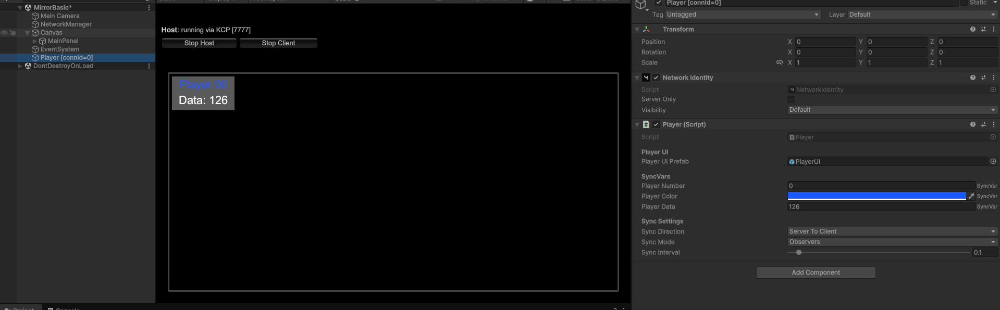

Each player is composed of:

* A **NetworkIdentity**
* One or more scripts inheriting from `NetworkBehaviour`

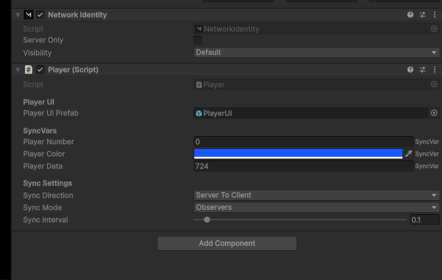

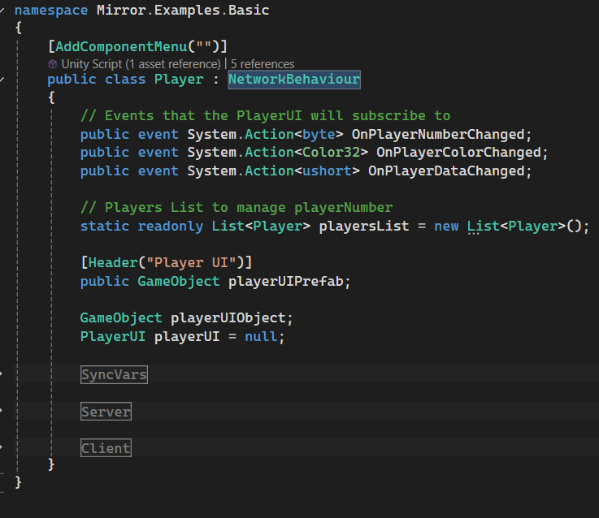

---

# The Demo Player Script

```cs

using System.Collections.Generic;
using UnityEngine;

namespace Mirror.Examples.Basic
{
    [AddComponentMenu("")]
    public class Player : NetworkBehaviour
    {
        // Events that the PlayerUI will subscribe to
        public event System.Action<byte> OnPlayerNumberChanged;
        public event System.Action<Color32> OnPlayerColorChanged;
        public event System.Action<ushort> OnPlayerDataChanged;

        // Players List to manage playerNumber
        static readonly List<Player> playersList = new List<Player>();

        [Header("Player UI")]
        public GameObject playerUIPrefab;

        GameObject playerUIObject;
        PlayerUI playerUI = null;

        #region SyncVars

        [Header("SyncVars")]

        /// <summary>
        /// This is appended to the player name text, e.g. "Player 01"
        /// </summary>
        [SyncVar(hook = nameof(PlayerNumberChanged))]
        public byte playerNumber = 0;

        /// <summary>
        /// Random color for the playerData text, assigned in OnStartServer
        /// </summary>
        [SyncVar(hook = nameof(PlayerColorChanged))]
        public Color32 playerColor = Color.white;

        /// <summary>
        /// This is updated by UpdateData which is called from OnStartServer via InvokeRepeating
        /// </summary>
        [SyncVar(hook = nameof(PlayerDataChanged))]
        public ushort playerData = 0;

        // This is called by the hook of playerNumber SyncVar above
        void PlayerNumberChanged(byte _, byte newPlayerNumber)
        {
            OnPlayerNumberChanged?.Invoke(newPlayerNumber);
        }

        // This is called by the hook of playerColor SyncVar above
        void PlayerColorChanged(Color32 _, Color32 newPlayerColor)
        {
            OnPlayerColorChanged?.Invoke(newPlayerColor);
        }

        // This is called by the hook of playerData SyncVar above
        void PlayerDataChanged(ushort _, ushort newPlayerData)
        {
            OnPlayerDataChanged?.Invoke(newPlayerData);
        }

        #endregion

        #region Server

        /// <summary>
        /// This is invoked for NetworkBehaviour objects when they become active on the server.
        /// <para>This could be triggered by NetworkServer.Listen() for objects in the scene, or by NetworkServer.Spawn() for objects that are dynamically created.</para>
        /// <para>This will be called for objects on a "host" as well as for object on a dedicated server.</para>
        /// </summary>
        public override void OnStartServer()
        {
            base.OnStartServer();

            // Add this to the static Players List
            playersList.Add(this);

            // set the Player Color SyncVar
            playerColor = Random.ColorHSV(0f, 1f, 0.9f, 0.9f, 1f, 1f);

            // set the initial player data
            playerData = (ushort)Random.Range(100, 1000);

            // Start generating updates
            InvokeRepeating(nameof(UpdateData), 1, 1);
        }

        // This is called from BasicNetManager OnServerAddPlayer and OnServerDisconnect
        // Player numbers are reset whenever a player joins / leaves
        [ServerCallback]
        internal static void ResetPlayerNumbers()
        {
            byte playerNumber = 0;
            foreach (Player player in playersList)
                player.playerNumber = playerNumber++;
        }

        // This only runs on the server, called from OnStartServer via InvokeRepeating
        [ServerCallback]
        void UpdateData()
        {
            playerData = (ushort)Random.Range(100, 1000);
        }

        /// <summary>
        /// Invoked on the server when the object is unspawned
        /// <para>Useful for saving object data in persistent storage</para>
        /// </summary>
        public override void OnStopServer()
        {
            CancelInvoke();
            playersList.Remove(this);
        }

        #endregion

        #region Client

        /// <summary>
        /// Called on every NetworkBehaviour when it is activated on a client.
        /// <para>Objects on the host have this function called, as there is a local client on the host. The values of SyncVars on object are guaranteed to be initialized correctly with the latest state from the server when this function is called on the client.</para>
        /// </summary>
        public override void OnStartClient()
        {
            // Instantiate the player UI as child of the Players Panel
            playerUIObject = Instantiate(playerUIPrefab, CanvasUI.GetPlayersPanel());
            playerUI = playerUIObject.GetComponent<PlayerUI>();

            // wire up all events to handlers in PlayerUI
            OnPlayerNumberChanged = playerUI.OnPlayerNumberChanged;
            OnPlayerColorChanged = playerUI.OnPlayerColorChanged;
            OnPlayerDataChanged = playerUI.OnPlayerDataChanged;

            // Invoke all event handlers with the initial data from spawn payload
            OnPlayerNumberChanged.Invoke(playerNumber);
            OnPlayerColorChanged.Invoke(playerColor);
            OnPlayerDataChanged.Invoke(playerData);
        }

        /// <summary>
        /// Called when the local player object has been set up.
        /// <para>This happens after OnStartClient(), as it is triggered by an ownership message from the server. This is an appropriate place to activate components or functionality that should only be active for the local player, such as cameras and input.</para>
        /// </summary>
        public override void OnStartLocalPlayer()
        {
            // Set isLocalPlayer for this Player in UI for background shading
            playerUI.SetLocalPlayer();

            // Activate the main panel
            CanvasUI.SetActive(true);
        }

        /// <summary>
        /// Called when the local player object is being stopped.
        /// <para>This happens before OnStopClient(), as it may be triggered by an ownership message from the server, or because the player object is being destroyed. This is an appropriate place to deactivate components or functionality that should only be active for the local player, such as cameras and input.</para>
        /// </summary>
        public override void OnStopLocalPlayer()
        {
            // Disable the main panel for local player
            CanvasUI.SetActive(false);
        }

        /// <summary>
        /// This is invoked on clients when the server has caused this object to be destroyed.
        /// <para>This can be used as a hook to invoke effects or do client specific cleanup.</para>
        /// </summary>
        public override void OnStopClient()
        {
            // disconnect event handlers
            OnPlayerNumberChanged = null;
            OnPlayerColorChanged = null;
            OnPlayerDataChanged = null;

            // Remove this player's UI object
            Destroy(playerUIObject);
        }

        #endregion
    }
}

```

---

# Try It Yourself

## Playing Alone

Build the project for **Windows** or **Android**.

Replace `localhost` with your computer's local IP address (for example `192.168.178.1`).

Run one copy as the server and another as the client.

## Playing With a Partner

Both of you should work on the same project.

Use your normal Git workflow:

* Add
* Commit
* Push
* Pull

Then both of you press **Play**.

One person starts the **Host**, while the other connects as the **Client**.

---

# Add Tick Using the Package Manager

This tool lets you quickly listen for buttons, axes, and joystick input in Unity. It also provides simple coroutine helpers that perform an action every *N* seconds, making it very useful for rapid prototyping.

[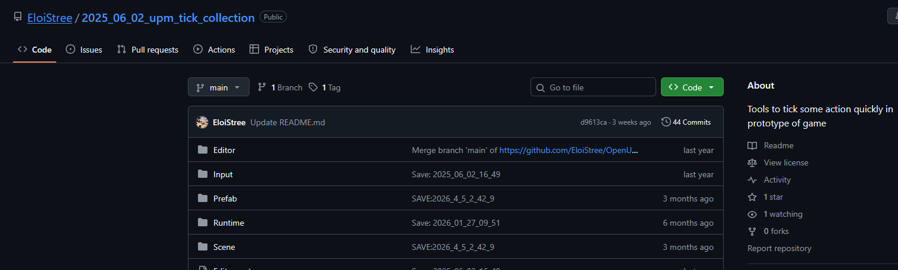](https://github.com/EloiStree/2025_06_02_upm_tick_collection)

[https://github.com/EloiStree/2025_06_02_upm_tick_collection.git](https://github.com/EloiStree/2025_06_02_upm_tick_collection.git)

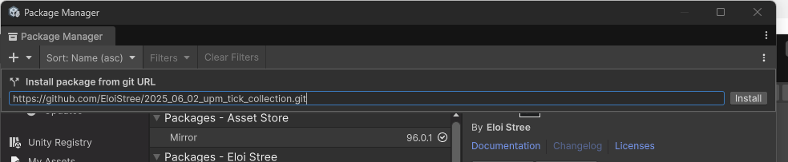

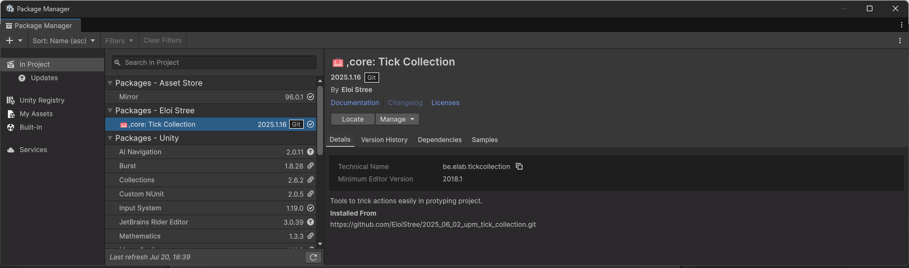

---

# Example: Basic

Perform an action when the application starts.

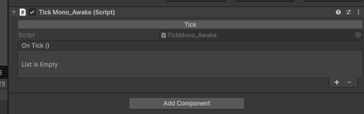

Perform an action a few seconds after startup.

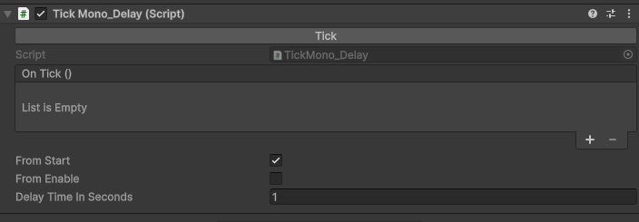

Perform an action every **N** seconds.

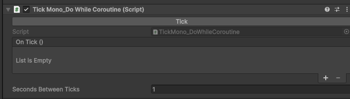

Add a little randomness.

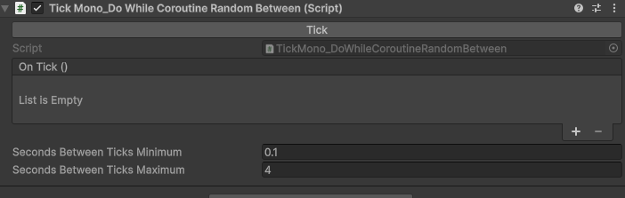

---

# Example: Input

In VR, I use this package a lot because it lets me quickly listen for button presses.

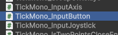

Listen for a button created in Unity's **Input Actions**.

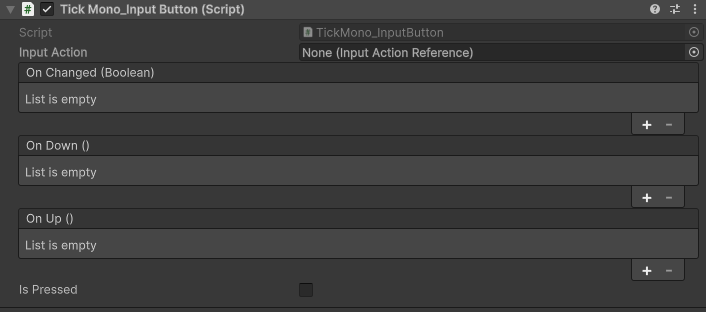

Listen for a controller trigger.

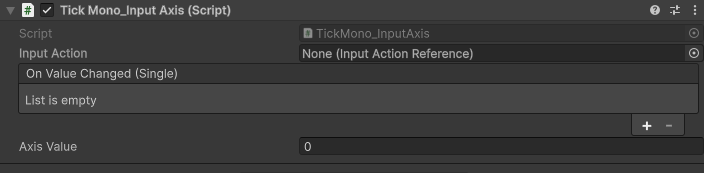

Listen for a Quest or gamepad joystick.

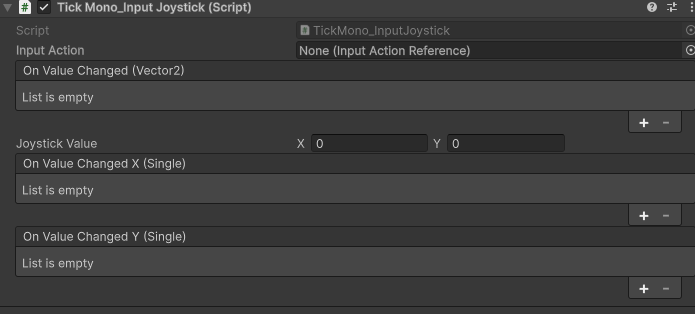

Remember that you first need an **Input Action** asset.

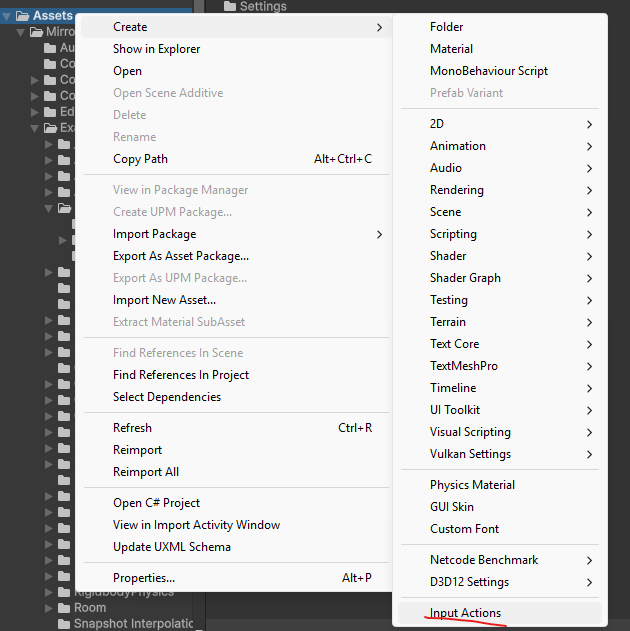

Add an **Action** and a **Binding**.

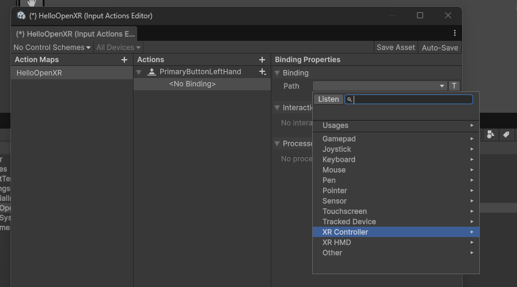

Search for the left-hand button.

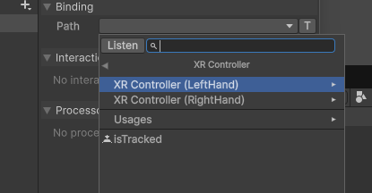

On most XR controllers, the two main buttons are called **Primary** and **Secondary**.

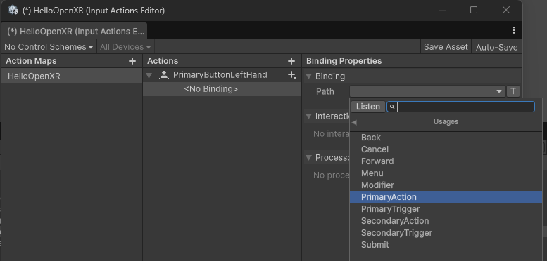

You can find more information about **OpenXR Input** here.

[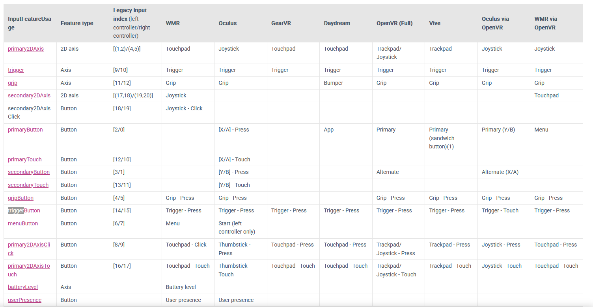](https://docs.unity3d.com/6000.5/Documentation/Manual/xr_input.html)

[https://docs.unity3d.com/6000.5/Documentation/Manual/xr_input.html](https://docs.unity3d.com/6000.5/Documentation/Manual/xr_input.html)

Listen for the grip button underneath the fingers using **Listen**.

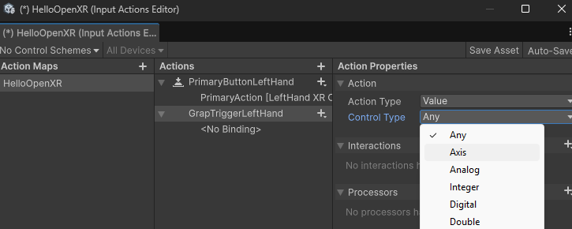

If you are not using VR, you can use a gamepad trigger instead.

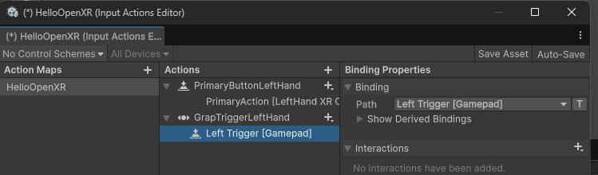

Or listen for two keyboard keys.

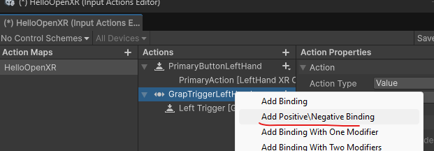

Add a stick that returns a `Vector2`.

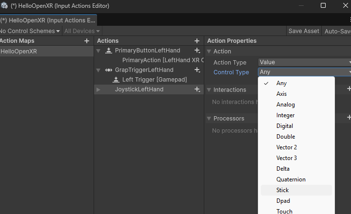

This works for both a gamepad and an OpenXR joystick.

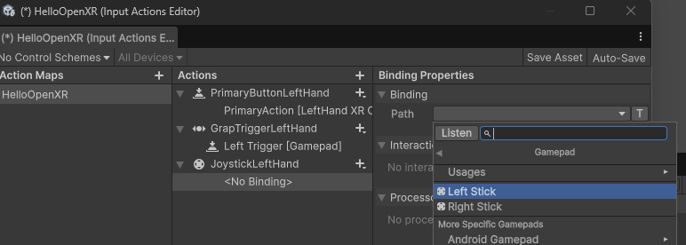

If you want to test with a gamepad:

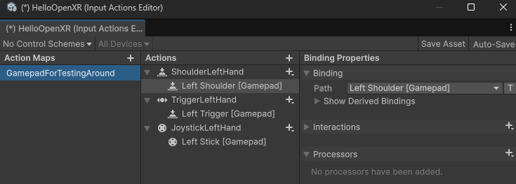

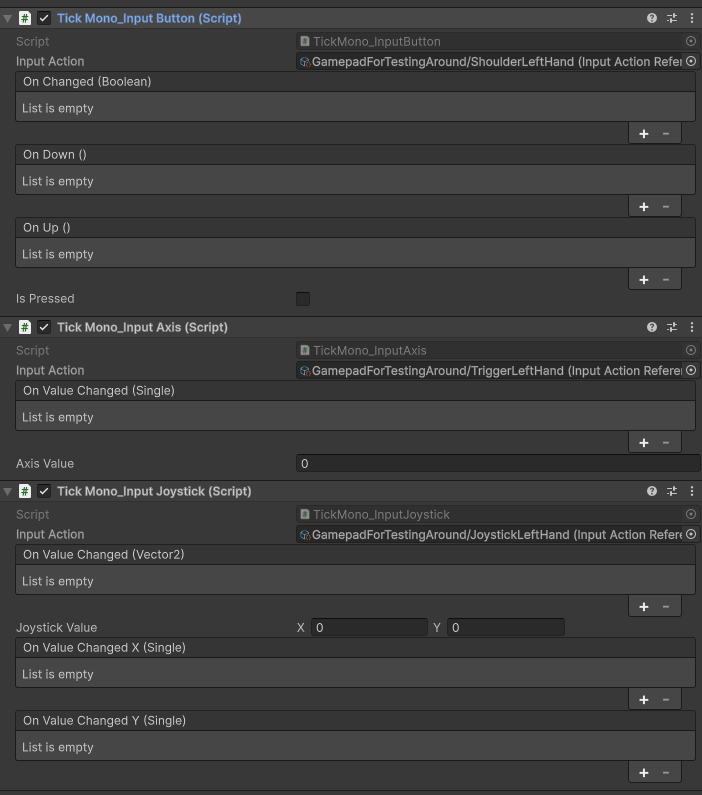

---

# Useful Examples

Quickly detect a collision.

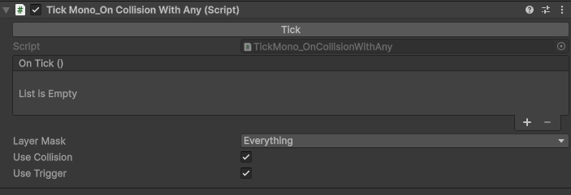

Click on an object.

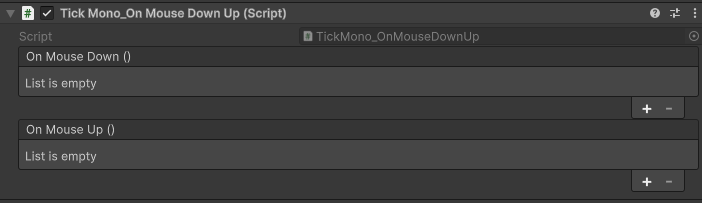

Convert primitive values into strings for debugging.

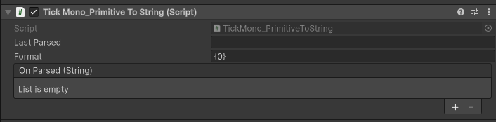

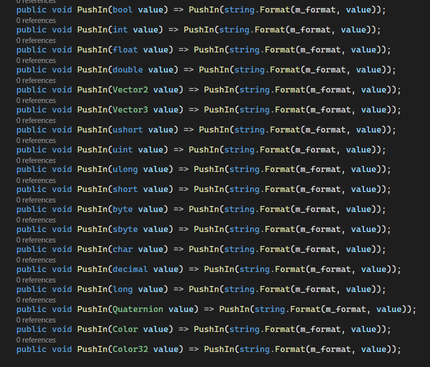

Quickly create a prefab for testing.

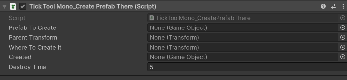

---

# What's Next?

Now that the project is running, we'll study each networking feature one by one:

* `SyncVar`
* `Command`
* `ClientRpc`
* `TargetRpc`
* and several others.

Before that, let's learn what an **IPv4 address** is, the difference between **public** and **local** addresses, and what a **port** is.
