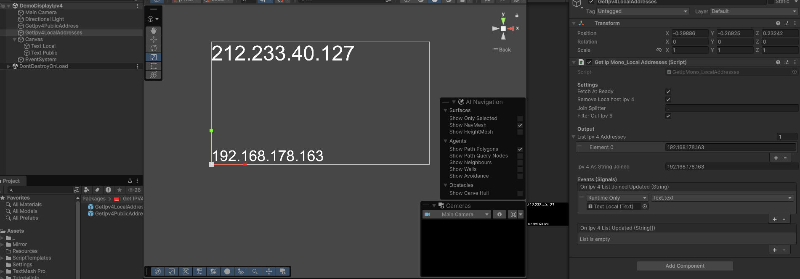
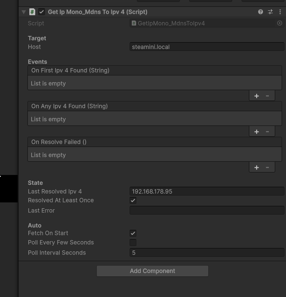

# Let's try to display IPV4 in our games


Godot Version of  the toolbox:  
https://github.com/EloiStree/2026_07_20_gdp_get_ipv4_info/tree/main/script

Unity Version of the toolbox:  
https://github.com/EloiStree/2026_07_20_upm_get_ipv4_info/tree/main/script

----------------------------

All devices connected to the web have two addresses: a public one, which is the external IP, and a local address that is inside the building behind the router.



# Public Address

To have access to the public address, you need to ask your IP to a website.

The most well-known is https://api.ipify.org

```cs

using System;
using System.Collections;
using UnityEngine;
using UnityEngine.Events;
using UnityEngine.Networking;

namespace Eloi.GetIpInfo
{
    public class GetIpMono_PublicAddress : MonoBehaviour
    {
        public UnityEvent<string> m_onPublicIpv4Updated;
        public UnityEvent m_onPublicIpv4NotFoundUpdated;

        public bool m_fetchAtStart = true;

        [Header("Debug")]
        public string m_lastPublicIpv4 = "";

        void Start()
        {
            if (m_fetchAtStart)
            {
                FetchPublicIpv4();
            }
        }

        public void FetchPublicIpv4()
        {
            StartCoroutine(FetchPublicIpv4Routine());
        }

        private IEnumerator FetchPublicIpv4Routine()
        {
            string url = "https://api.ipify.org";
            using (UnityWebRequest webRequest = UnityWebRequest.Get(url))
            {
                yield return webRequest.SendWebRequest();

                if (webRequest.result == UnityWebRequest.Result.Success && webRequest.responseCode == 200)
                {
                    string ip = webRequest.downloadHandler.text.Trim();

                    m_lastPublicIpv4 = ip;
                    m_onPublicIpv4Updated?.Invoke(ip);
                }
                else
                {
                    m_lastPublicIpv4 = "";
                    m_onPublicIpv4NotFoundUpdated?.Invoke();
                }
            } 
        }
    }
}
```

# Local Address

Your computer can be connected to several internet cables and several Wi-Fi networks.

Using Hamachi can create an IPv4 and VPN too.

This means that a computer can have 1-12 IPv4 addresses because of software on your computer.

There are conventions. 
192.168.0.0 and 10.0.0.0 usually mean that the IP is a local address.

```cs
using System;
using System.Collections.Generic;
using System.Net;
using System.Net.Sockets;
using UnityEngine;
using UnityEngine.Events;

namespace Eloi.GetIpInfo
{
    public class GetIpMono_LocalAddresses : MonoBehaviour
    {
        [Header("Settings")]
        public bool m_fetchAtReady = true;
        public bool m_removeLocalhostIpv4 = true;
        public string m_joinSplitter = ", ";
        public bool m_filterOutIpv6 = true;

        [Header("Output")]
        public List<string> m_listIpv4Addresses = new List<string>();
        public string m_ipv4AsStringJoined = "";

        [Header("Events (Signals)")]
        public UnityEvent<string> m_onIpv4ListJoinedUpdated;
        public UnityEvent<string[]> m_onIpv4ListUpdated;

        void Start()
        {
            if (m_fetchAtReady)
            {
                FetchLocalIpv4();
            }
        }

        public bool IsIpv4AddressValid(string ipv4)
        {
            if (string.IsNullOrEmpty(ipv4)) return false;

            string[] parts = ipv4.Split('.');
            if (parts.Length != 4)
            {
                return false;
            }

            foreach (string part in parts)
            {
                if (int.TryParse(part, out int num))
                {
                    if (num < 0 || num > 255)
                    {
                        return false;
                    }
                }
                else
                {
                    return false; 
                }
            }
            return true;
        }

        public void FetchLocalIpv4()
        {
            m_listIpv4Addresses.Clear();

            try
            {
                string hostName = Dns.GetHostName();
                IPAddress[] addresses = Dns.GetHostAddresses(hostName);
                foreach (IPAddress address in addresses)
                {
                    string ip = address.ToString();
                    if (address.AddressFamily == AddressFamily.InterNetwork)
                    {
                        if (m_removeLocalhostIpv4 && (ip == "127.0.0.1" || ip == "localhost"))
                        {
                            continue;
                        }

                        if (m_filterOutIpv6 && !IsIpv4AddressValid(ip))
                        {
                            continue;
                        }

                        m_listIpv4Addresses.Add(ip);
                    }
                }
            }
            catch (Exception e)
            {
                Debug.LogError($"Error fetching local IP addresses: {e.Message}");
            }

            m_onIpv4ListUpdated?.Invoke(m_listIpv4Addresses.ToArray());
            m_ipv4AsStringJoined = string.Join(m_joinSplitter, m_listIpv4Addresses);
            m_onIpv4ListJoinedUpdated?.Invoke(m_ipv4AsStringJoined);
        }
    }
}
```

# mDNS



Example classics:   
- http://raspberrypi.local
- http://steamdeck.local

```cs
using System;
using System.Linq;
using System.Net;
using System.Net.Sockets;
using System.Threading;
using System.Collections.Generic;
using UnityEngine;
using UnityEngine.Events;

namespace Eloi.GetIpInfo
{
    [Serializable]
    public class StringIpEvent : UnityEvent<string> { }

    public class GetIpMono_MdnsToIpv4 : MonoBehaviour
    {
        [Header("Target")]
        [Tooltip("e.g. raspberrypi.local, steamdeck.local, myhost.ddns.net")]
        public string m_host = "raspberrypi.local";

        [Header("Events")]
        public StringIpEvent m_onFirstIpv4Found = new StringIpEvent();
        public StringIpEvent m_onAnyIpv4Found = new StringIpEvent();
        public UnityEvent m_onResolveFailed = new UnityEvent();

        [Header("State")]
        [SerializeField] private string m_lastResolvedIpv4 = "";
        [SerializeField] private bool m_resolvedAtLeastOnce = false;
        [SerializeField] private string m_lastError = "";

        [Header("Auto")]
        public bool m_fetchOnStart = true;
        public bool m_pollEveryFewSeconds = false;
        public float m_pollIntervalSeconds = 5f;
        private float _nextPollTime;


        [ContextMenu("Set Host: Raspberry Pi")]
        public void SetHostRaspberryPi() { m_host = "raspberrypi.local"; FetchNow(); }

        [ContextMenu("Set Host: Steam Deck")]
        public void SetHostSteamDeck() { m_host = "steamdeck.local"; FetchNow(); }

        [ContextMenu("Set Host: ESP32 / Espressif")]
        public void SetHostEspressif() { m_host = "espressif.local"; FetchNow(); }

        [ContextMenu("Set Host: BeagleBone")]
        public void SetHostBeagleBone() { m_host = "beaglebone.local"; FetchNow(); }

        [ContextMenu("Set Host: Odroid")]
        public void SetHostOdroid() { m_host = "odroid.local"; FetchNow(); }

        [ContextMenu("Set Host: Arduino")]
        public void SetHostArduino() { m_host = "arduino.local"; FetchNow(); }

        [ContextMenu("Resolve Now")]
        public void ContextMenuResolveNow() => FetchNow();

        
        public void FetchNow() => ResolveAsync(m_host);

        public void Resolve(string host) => ResolveAsync(host);

        public static string ResolveToIpv4(string host)
        {
            if (string.IsNullOrWhiteSpace(host)) return null;
            try
            {
                IPAddress[] addrs = Dns.GetHostAddresses(host);
                foreach (var a in addrs)
                    if (a.AddressFamily == AddressFamily.InterNetwork)
                        return a.ToString();
            }
            catch (Exception e) { Debug.LogWarning($"[MdnsToIpv4] Resolve failed for '{host}': {e.Message}"); }
            return null;
        }

        private CancellationTokenSource _cts;

        private async void ResolveAsync(string host)
        {
            if (string.IsNullOrWhiteSpace(host))
            {
                m_lastError = "Host is empty.";
                m_onResolveFailed?.Invoke();
                return;
            }

            _cts?.Cancel();
            _cts = new CancellationTokenSource();
            var token = _cts.Token;

            string firstIpv4 = null;
            string error = null;

            await System.Threading.Tasks.Task.Run(() =>
            {
                try
                {
                    IPAddress[] addrs = Dns.GetHostAddresses(host);
                    foreach (var a in addrs)
                    {
                        if (a.AddressFamily == AddressFamily.InterNetwork)
                        {
                            firstIpv4 = a.ToString();
                            break;
                        }
                    }
                    if (firstIpv4 == null)
                        error = $"Host '{host}' resolved but had no IPv4 (only IPv6?).";
                }
                catch (SocketException sx) { error = $"Socket: {sx.SocketErrorCode} - {sx.Message}"; }
                catch (Exception ex) { error = ex.Message; }
            }, token);

            if (token.IsCancellationRequested) return;

            if (!string.IsNullOrEmpty(firstIpv4))
            {
                m_lastError = "";
                m_lastResolvedIpv4 = firstIpv4;

                if (!m_resolvedAtLeastOnce)
                {
                    m_resolvedAtLeastOnce = true;
                    m_onFirstIpv4Found?.Invoke(firstIpv4);
                }
                m_onAnyIpv4Found?.Invoke(firstIpv4);
            }
            else
            {
                m_lastError = error ?? "Unknown resolve error.";
                Debug.LogWarning($"[MdnsToIpv4] {m_lastError}");
                m_onResolveFailed?.Invoke();
            }
        }

        private void OnDestroy() => _cts?.Cancel();


        private void Start()
        {
            if (m_fetchOnStart) FetchNow();
            _nextPollTime = Time.time + m_pollIntervalSeconds;
        }

        private void Update()
        {
            if (m_pollEveryFewSeconds && Time.time >= _nextPollTime)
            {
                _nextPollTime = Time.time + m_pollIntervalSeconds;
                FetchNow();
            }
        }
    }
}
```
