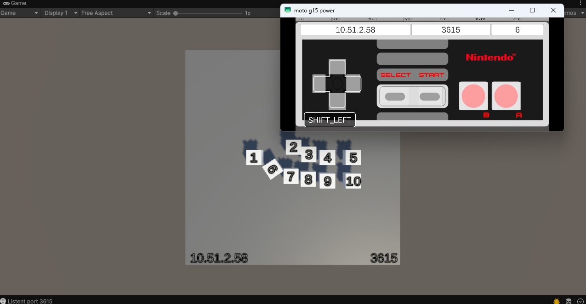
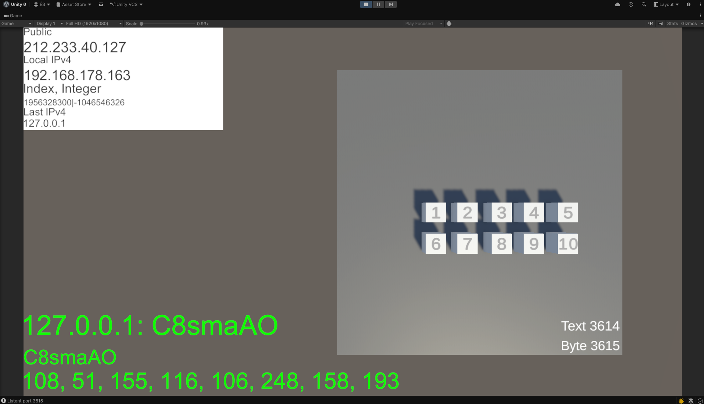
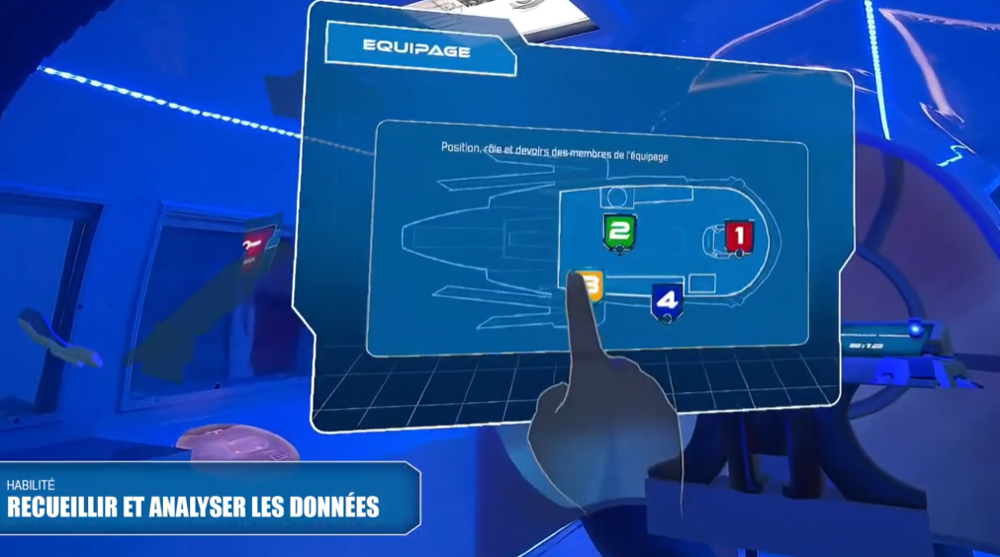

While I was writing the UDP part, I feel on this workshop.

And if I am not wroong some of you did it during the discovering workshop


[
](https://youtu.be/Bm82lf1dmkY?t=584)    
Video: https://youtu.be/Bm82lf1dmkY?t=584  
Workshop: https://github.com/EloiStree/2026_01_18_upm_nes_udp_multiplayer 

I added information on IPV4 and Byte received.



Project Unity:
https://github.com/EloiStree/2026_01_18_unity_nes_multi_controller/blob/main/README.md


--------

Example of python UDP and Websocket   
https://github.com/EloiStree/2024_05_17_python_basic_udp_websocket_iid_example   

---------


----


# Relocation of point in Unity with math

```cs

 public static void GetWorldToLocal_DirectionalPoint(in Vector3 worldPosition, in Quaternion worldRotation, in Vector3 positionReference, in Quaternion rotationReference, out Vector3 localPosition, out Quaternion localRotation)
 {
     localRotation = Quaternion.Inverse(rotationReference) * worldRotation;
     localPosition = Quaternion.Inverse(rotationReference) * (worldPosition - positionReference);
 }
 public static void GetLocalToWorld_DirectionalPoint(in Vector3 localPosition, in Quaternion localRotation, in Vector3 positionReference, in Quaternion rotationReference, out Vector3 worldPosition, out Quaternion worldRotation)
 {
     worldRotation = rotationReference * localRotation;
     worldPosition = (rotationReference * localPosition) + (positionReference);
 }
```


-----------------

# Send UDP with python

A copilote example:
```py

import socket
import struct
import time
import random
import string

HOST = "127.0.0.1"
PORT_BYTE = 3615
PORT_TEXT = 3614

while True:
    try:
        # Create UDP socket
        with socket.socket(socket.AF_INET, socket.SOCK_DGRAM) as s:
            # Send random text of 1-60 characters
            random_text = ''.join(random.choices(string.ascii_letters + string.digits, k=random.randint(1, 60)))
            s.sendto(random_text.encode('utf-8'), (HOST, PORT_TEXT))
            print(f"Sent text: {random_text}")
            
            # Wait 2 seconds
            time.sleep(2)
            
            # Send a random byte from 1-16
            random_byte = random.randint(1, 16)
            s.sendto(struct.pack("<B", random_byte), (HOST, PORT_BYTE))
            print(f"Sent byte: {random_byte}")
            
            # Send random 8 bytes
            random_8_bytes = bytes([random.randint(0, 255) for _ in range(8)])
            s.sendto(random_8_bytes, (HOST, PORT_BYTE))
            print(f"Sent 8 bytes: {random_8_bytes.hex()}")
            
            print("---")

            time.sleep(1)  # Wait 1 second before sending the next message
            
    except OSError as e:
        print(f"Socket error: {e}")

    time.sleep(1)
```

-------------


# Note: Why create your own protocole.


## Cannon Moles example Quest vs patato mobile


[
](https://www.youtube.com/watch?v=XbhJoqWZ224)
https://www.youtube.com/watch?v=XbhJoqWZ224

Ajouter les images du prototype si je retrouve avec le 3D vs 2D


## Javascript console for client in Websocket

[](https://www.arteam-interactive.com/fr/portfolio-item/5minutes-avant-impact/)  
https://www.arteam-interactive.com/fr/portfolio-item/5minutes-avant-impact/   