# Building a Watch to Learn Mirror

To learn how to use Mirror, I suggest we start by building a simple watch.

Preparing the toolbox is an important step before we begin the networking lessons.

I'll show you how I built mine, but if you're in a hurry to learn Mirror, feel free to skip this part and simply use the finished package.

---

For fun, we'll create a small game object that works without VR but can later be reused in a VR project.

Our goal is to build a watch that has **no knowledge of Mirror**.

Once it is working, we'll connect it to Mirror through an interface.

Let's go back to the project we created earlier.

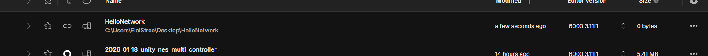

To keep the networking code separate from the visual part of the watch, we'll follow the **Model-View-Controller (MVC)** pattern.

This allows us to package the watch as a reusable Unity package that can be used in any project without depending on Mirror or on this specific project.

Repository:

https://github.com/EloiStree/2026_07_21_upm_unicode_watch_for_vr

[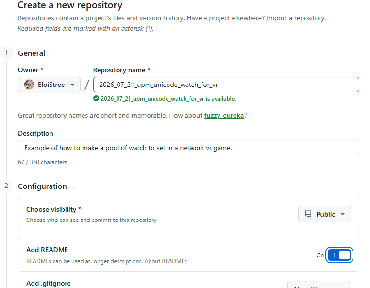](https://github.com/EloiStree/2026_07_21_upm_unicode_watch_for_vr)

If your project is **not** using Git, simply clone the repository:

```bash
git clone https://github.com/EloiStree/2026_07_21_upm_unicode_watch_for_vr.git Packages/be.elab.unicodewatch
```

If your project **is** using Git, add it as a submodule instead:

```bash
git submodule add https://github.com/EloiStree/2026_07_21_upm_unicode_watch_for_vr.git Packages/be.elab.unicodewatch
```

> **Note:** Unity prefers the package folder name to match the package namespace.

After cloning, your project should look like this:

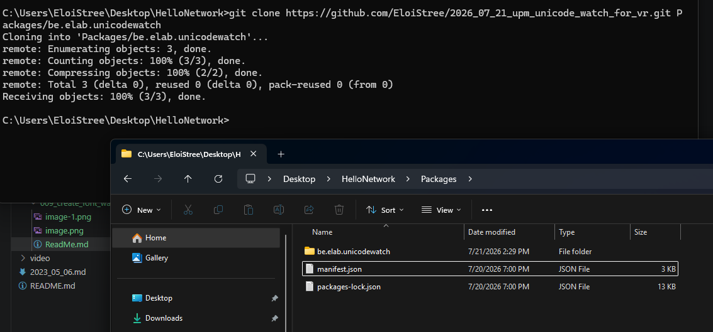

For Unity to recognize it as a package, it needs a **package.json** file.

You can read the official documentation here:

https://docs.unity3d.com/6000.5/Documentation/Manual/upm-manifestPkg.html

Or, more simply, copy the `package.json` file from one of your existing Unity packages.

`package.json`
``` json
{
  "name": "be.elab.unicodewatch",
  "version": "2026.1.18",
  "displayName": "\ud83e\uddf0: Unicode Watch Pool for VR Network games.",
  "description": "Provide a simple Unicode Watch to communicate in game.",
  "unity": "2019.1",
  "unityRelease": "0b5",
  "documentationUrl": "https://github.com/EloiStree/2026_07_21_upm_unicode_watch_for_vr",
  "changelogUrl": "https://github.com/EloiStree/2026_07_21_upm_unicode_watch_for_vr/tree/main",
  "licensesUrl": "https://github.com/EloiStree/License",
 "keywords": [
        "Script",
        "Tool",
        "Productivity"
    ],     
 "samples": [
    {
      "displayName": "Demo Scene",
      "description": "A sample scene that demonstrates the features of this package.",
      "path": "Scene/Demo"
    }
  ],
  "author": {
    "name": "Eloi Stree",
    "mail": "",
    "url": "https://github.com/EloiStree/"
  }
}
```


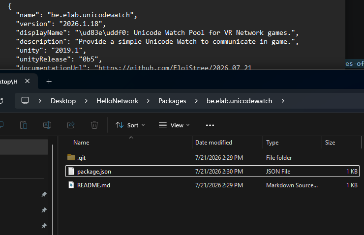

Let's give the package a better name. 😉

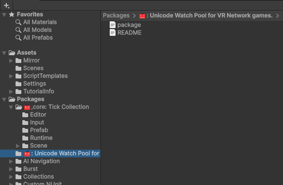

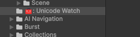

Then commit your changes and push them to GitHub.

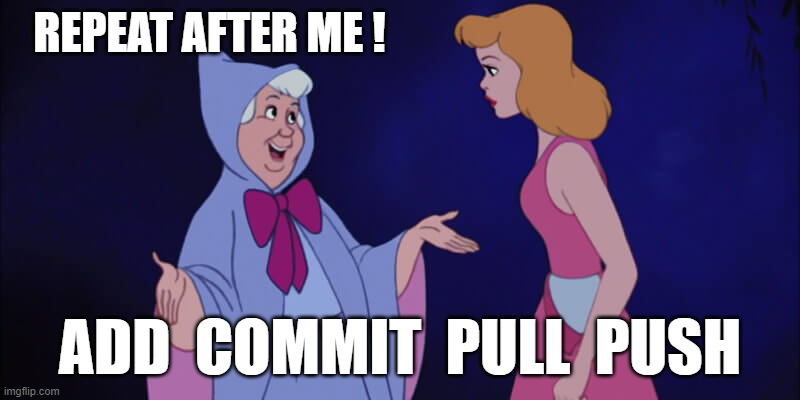

At this point, we have an empty Unity package ready to use.

---

# Keeping Things Friendly

To avoid having to deal with players insulting each other, our watch will only display neutral information.

It will be able to:

* Change its color.
* Display a unique identifier:

  * As an image if one is provided by the game designer.
  * As text using an open-source font otherwise.
* Display the current server time.

When building a prototype, always start with simple shapes like cubes and spheres.

Let's create a demo scene that shows how to use our package.

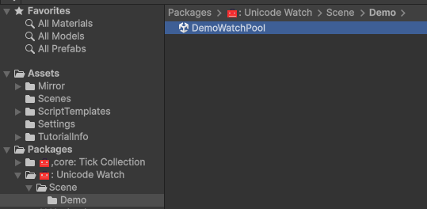

Everything inside the `Scene/Demo` folder will be copied into the user's project when they click **Import Samples** in the Unity Package Manager.

```json
"samples": [
  {
    "displayName": "Demo Scene",
    "description": "A sample scene that demonstrates the features of this package.",
    "path": "Scene/Demo"
  }
],
```

Now it's time for some **grayboxing**.

Here's my amazing watch prototype.

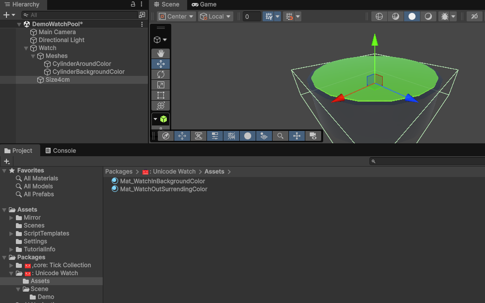

We'll add a **TextMesh Pro** component to display text.

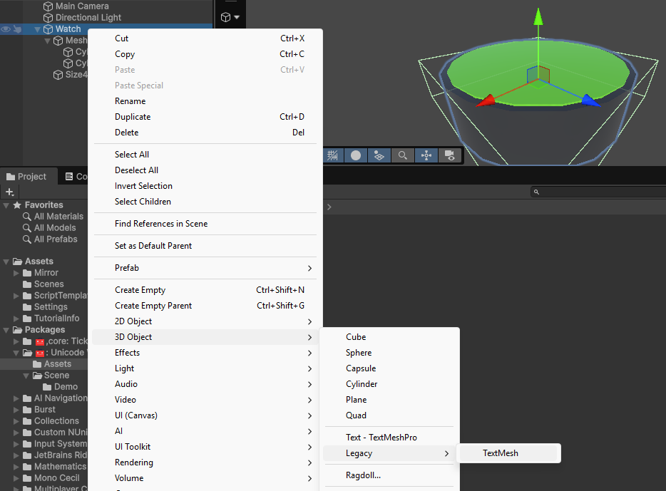

And a simple **Quad** to display an image whenever one is available.

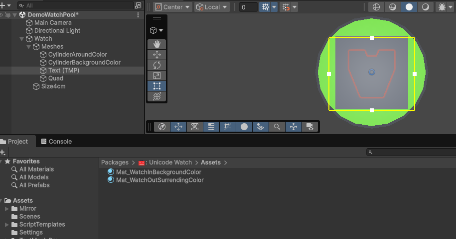

Create a prefab, then duplicate it to represent all 12 players (or watches) in the scene.

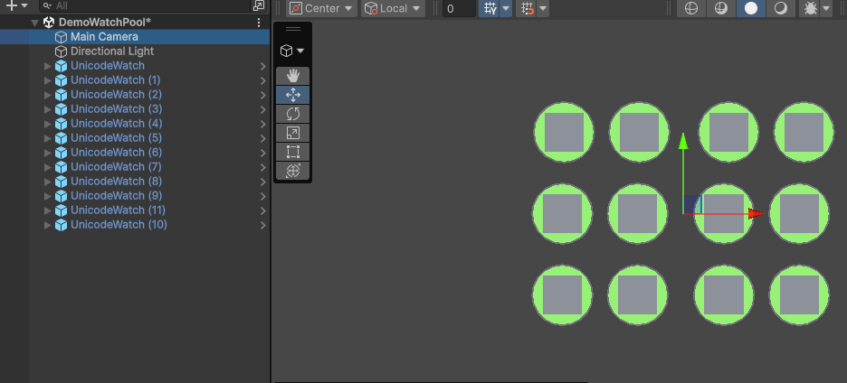

Just like the **CCC principle** and the **Four Pillars**, it's important to define the rules from the beginning. Otherwise, you'll constantly be tempted to add unnecessary features.

Let's define a simple interface and expose Unity Events for interaction.

To keep the package modular, create an **Assembly Definition** (`.asmdef`) in the `Runtime` folder.

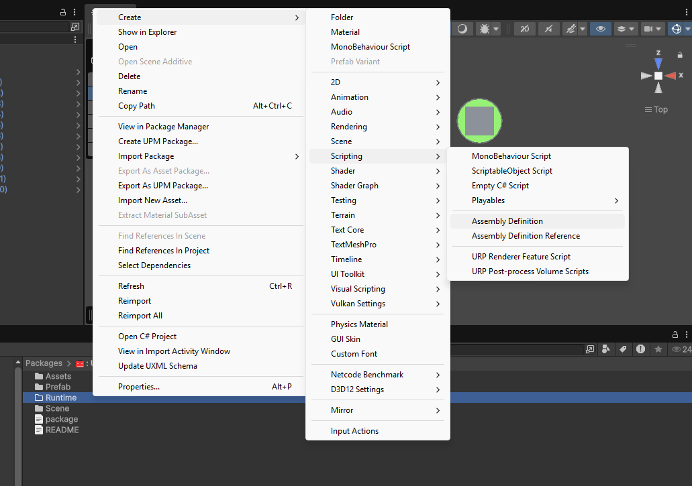

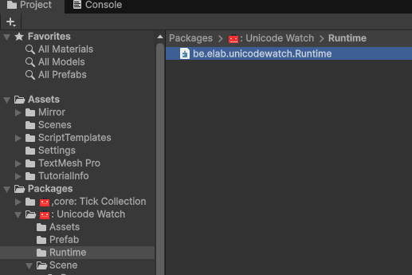

You can also define the default namespace, making it easier to create new scripts that belong to the package.

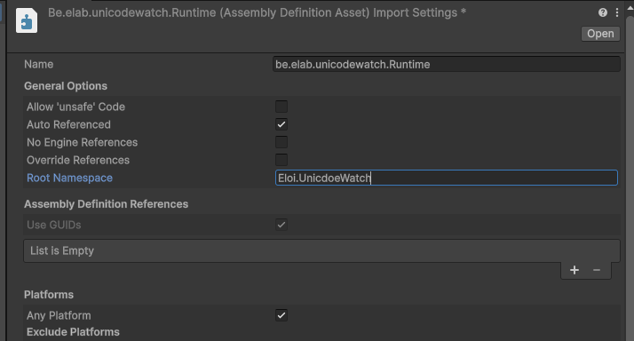

## Example of what the watch could display

```cs
using UnityEngine;

namespace Eloi.UnicodeWatch
{
    public interface I_UnicodeWatchGetSet : I_UnicodeWatchGet , I_UnicodeWatchSet{}
    public interface I_UnicodeWatchGet
    {
        public void GetWatchDisplayColor(out Color color);
        public void GetWatchDisplayUnicode(out string unicode);
        
        public void GetServerWatchTimeUtcAdjusted(out int hours24, out int minutes59, out int seconds59, out int milliseconds999, out long ticksSinceGiven);
        public void GetClientLocalWatchTimeUtcAdjusted(out int hours24, out int minutes59, out int seconds59, out int milliseconds999, out long ticksSinceGiven);
        public void GetLastGivenPingAsTicks(out long pingAsTicks);
    }
    public interface I_UnicodeWatchSet
    {
        public void SetWatchWithColor(Color color);
        public void SetWatchWithUnicode(string unicode);

        public void SetServerWatchTimeUtc(int hours, int minutes, int seconds, int milliseconds);
        public void SetClientLocalWatchTimeUtc(int hours, int minutes, int seconds, int milliseconds);
        public void SetPingAsTicks(long pingAsTicks);
    }
}
```

Now we need a `MonoBehaviour` that acts as a bridge between the developer using the package and the developers and designers creating the watch.

```cs
using UnityEngine;
using UnityEngine.Events;
namespace Eloi.UnicodeWatch
{
    [System.Serializable]
    public class WatchClockTime
    {
        [Range(0, 23)]
        public int m_hours24;
        [Range(0, 59)]
        public int m_minutes59;
        [Range(0, 59)]
        public int m_seconds59;
        [Range(0, 999)]
        public int m_milliseconds999;
        public long m_localTicksWhenGiven;
    }
    public class UnicodeWatchMono_Facade : MonoBehaviour, I_UnicodeWatchGetSet
    {
        public Color m_givenColor;
        public string m_givenUnicode;
        public WatchClockTime m_serverTimeUtc;
        public WatchClockTime m_clientLocalTimeUtc;
        public long m_ticksPing;

        public UnityEvent<Color> m_onColorUpdated;
        public UnityEvent<Color> m_onColorChanged;
        public UnityEvent<string> m_onUnicodeUpdated;
        public UnityEvent<string> m_onUnicodeChanged;
        public UnityEvent<WatchClockTime> m_onServerTimeUtcUpdated;
        public UnityEvent<WatchClockTime> m_onClientLocalTimeUtcUpdated;
    }
}
```

And now it's time to complete the implementation.

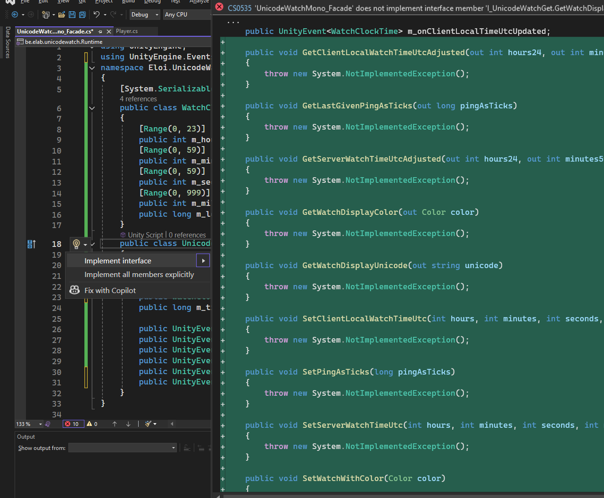

Let's retrieve the information and update the watch accordingly.

```cs
public void GetLastGivenPingAsTicks(out long pingAsTicks)=> pingAsTicks = m_ticksPing;
public void GetWatchDisplayColor(out Color color) => color = m_givenColor;
public void GetWatchDisplayUnicode(out string unicode) => unicode = m_givenUnicode;
public void GetClientLocalWatchTimeUtcAdjusted(out int hours24, out int minutes59, out int seconds59, out int milliseconds999, out long ticksSinceGiven)
{
    hours24 = m_serverTimeUtc.m_hours24;
    minutes59 = m_serverTimeUtc.m_minutes59;
    seconds59 = m_serverTimeUtc.m_seconds59;
    milliseconds999 = m_serverTimeUtc.m_milliseconds999;
    long additionalTick = System.DateTime.UtcNow.Ticks - m_serverTimeUtc.m_localTicksWhenGiven;
    ticksSinceGiven = m_serverTimeUtc.m_localTicksWhenGiven;
}
public void GetServerWatchTimeUtcAdjusted(out int hours24, out int minutes59, out int seconds59, out int milliseconds999, out long ticksSinceGiven)
{
    hours24 = m_clientLocalTimeUtc.m_hours24;
    minutes59 = m_clientLocalTimeUtc.m_minutes59;
    seconds59 = m_clientLocalTimeUtc.m_seconds59;
    milliseconds999 = m_clientLocalTimeUtc.m_milliseconds999;
    long additionalTick = System.DateTime.UtcNow.Ticks - m_clientLocalTimeUtc.m_localTicksWhenGiven;
    ticksSinceGiven = m_clientLocalTimeUtc.m_localTicksWhenGiven;
}
```

And set the value
```cs
        public void SetPingAsTicks(long pingAsTicks)
        {
            m_ticksPing = pingAsTicks;
            m_onPingTickUpdated?.Invoke(m_ticksPing);
        }
        public void SetWatchWithColor(Color color)
        {
            m_givenColor = color;
            m_onColorUpdated?.Invoke(m_givenColor);
        }
        public void SetWatchWithUnicode(string unicode)
        {
            m_givenUnicode = unicode;
            m_onUnicodeUpdated?.Invoke(m_givenUnicode);
        }
        public void SetClientLocalWatchTimeUtc(int hours, int minutes, int seconds, int milliseconds)
        {
            m_clientLocalTimeUtc.m_hours24 = hours;
            m_clientLocalTimeUtc.m_minutes59 = minutes;
            m_clientLocalTimeUtc.m_seconds59 = seconds;
            m_clientLocalTimeUtc.m_milliseconds999 = milliseconds;
            m_clientLocalTimeUtc.m_localTicksWhenGiven = System.DateTime.UtcNow.Ticks;
            m_onClientLocalTimeUtcUpdated?.Invoke(m_clientLocalTimeUtc);
        }
        public void SetServerWatchTimeUtc(int hours, int minutes, int seconds, int milliseconds)
        {
            m_serverTimeUtc.m_hours24 = hours;
            m_serverTimeUtc.m_minutes59 = minutes;
            m_serverTimeUtc.m_seconds59 = seconds;
            m_serverTimeUtc.m_milliseconds999 = milliseconds;
            m_serverTimeUtc.m_localTicksWhenGiven = System.DateTime.UtcNow.Ticks;
            m_onServerTimeUtcUpdated?.Invoke(m_serverTimeUtc);
        }

```
The goal here isn't to implement game logic. It's simply to act as a bridge between the different developers working on the project.

We can also give the watch some player identification.

We'll use two identifiers:

* **Player Index**: a simple number that's easy to read and suitable for trusted games.
* **RSA Public Key**: a unique identifier for games where it's important to verify a player's identity.

The player index is convenient for local or trusted multiplayer games, while the RSA public key is better suited for competitive games or tournaments where player identity matters.

Let's create an ID class in case one of you wants to explore this topic further.

If you're building a chess game, for example, making sure each player is really who they claim to be is pretty important for tournaments. 😜

Once you have a public key, you can also generate a unique visual avatar using **Blockies**:

https://github.com/EloiStree/2021_05_29_upm_blockies


```cs
namespace Eloi.UnicodeWatch
{
    public interface I_UnicodeWatchIndexRsa :I_UnicodeWatchIndexRsaGet, I_UnicodeWatchIndexRsaSet{}
    public interface I_UnicodeWatchIndexRsaGet
    {
        public void GetPlayerIntIndex(out int playerIndex);
        public void GetPlayerPublicKey(out string playerPublicKey);
    }
    public interface I_UnicodeWatchIndexRsaSet
    {
        public void SetPlayerIntIndex(int playerIndex);
        public void SetPlayerPublicKey(string playerPublicKey);
    }
}
```


As ID and RSA is something I suppose I need to reused and wont change.
I like to make a C# class and a Mono Class

```cs

    [System.Serializable]
    public class UnicodeWatch_IndexAndRSA : I_UnicodeWatchIndexRsa
    {
        [SerializeField] int m_playerIndex;
        [SerializeField] string m_playerPublicKey;

        public void GetPlayerIntIndex(out int playerIndex) =>
            playerIndex = m_playerIndex;

        public void GetPlayerPublicKey(out string playerPublicKey) =>
            playerPublicKey = m_playerPublicKey;

        public void SetPlayerIntIndex(int playerIndex)
        {
            m_playerIndex = playerIndex;
        }
        public void SetPlayerPublicKey(string playerPublicKey)
        {
            m_playerPublicKey = playerPublicKey;
        }
    }

        public class UnicodeWatchMono_IndexAndRSA : MonoBehaviour, I_UnicodeWatchIndexRsa
    {
        [SerializeField] UnicodeWatch_IndexAndRSA m_playerIdentify;
        [SerializeField] UnityEvent<int> m_onPlayerIndexUpdated;
        [SerializeField] UnityEvent<string> m_onPlayerIndexUpdatedAsString;
        [SerializeField] UnityEvent<string> m_onPlayerPublicKeyUpdated;

        public void GetPlayerIntIndex(out int playerIndex) =>
            m_playerIdentify.GetPlayerIntIndex(out playerIndex);

        public void GetPlayerPublicKey(out string playerPublicKey)=>
            m_playerIdentify.GetPlayerPublicKey(out playerPublicKey);

        public void SetPlayerIntIndex(int playerIndex)
        {
            m_playerIdentify.SetPlayerIntIndex(playerIndex);
            m_onPlayerIndexUpdated?.Invoke(playerIndex);
            m_onPlayerIndexUpdatedAsString?.Invoke(playerIndex.ToString());
        }
        public void SetPlayerPublicKey(string playerPublicKey)
        {
            m_playerIdentify.SetPlayerPublicKey(playerPublicKey);
            m_onPlayerPublicKeyUpdated?.Invoke(playerPublicKey);
        }
    }
```
Since IDs and RSA keys are components that I expect to reuse and that are unlikely to change, I prefer to implement them as both a plain C# class and a `MonoBehaviour`.

The C# class contains the data and logic, while the `MonoBehaviour` makes it easy to use the same functionality directly in Unity scenes and prefabs.

Next, let's create a simple component that applies a color either to a `MeshRenderer` or to a camera, depending on the object it's attached to.


```cs
    public class UnicodeWatchMono_RelayColor : MonoBehaviour
    {
        public Color m_color;
        public Color m_colorLighter;
        public UnityEvent<Color> m_onColorUpdated;

        public Camera[] m_cameraToAffect;
        public MeshRenderer[] m_meshRendererToAffect;


        [Range(0f, 1f)] 
        public float m_percentColorLighter = 0.25f;

        public void SetColor(Color color)
        {
            m_color = color;
            m_colorLighter = Color.Lerp(m_color, Color.white, m_percentColorLighter);
            m_onColorUpdated?.Invoke(m_color);
            foreach (var cam in m_cameraToAffect)
            {
                if (cam != null)
                    cam.backgroundColor = m_color;
            }
            foreach (var mesh in m_meshRendererToAffect)
            {
                if (mesh != null)
                    mesh.material.color = m_color;
            }
        }
    }
```


Let's connect the parts that are already ready.
 We'll implement the remaining features later.


As long as we can change the Unicode character and the color, we're in good shape.


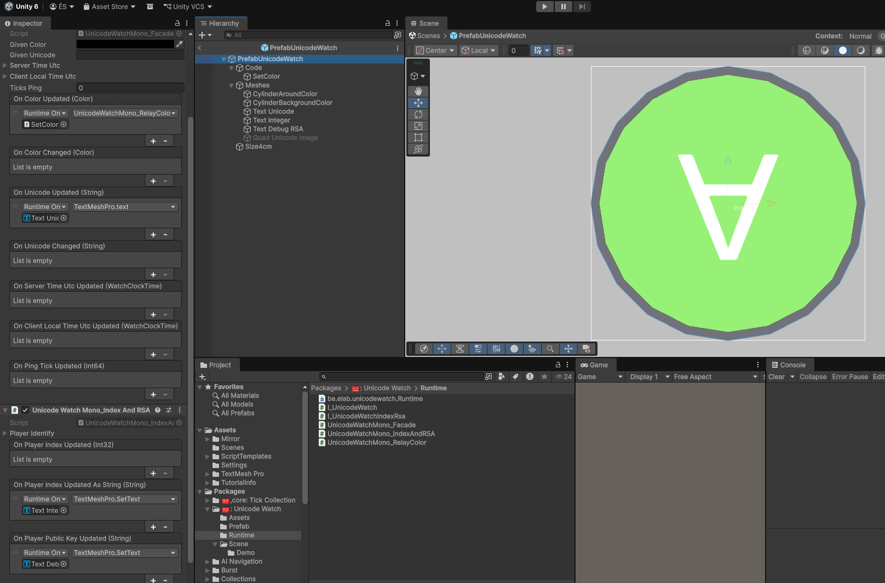

While we're at it, let's add a few **Context Menu** actions so we can quickly test everything directly from the Unity Inspector.


```cs
        [SerializeField] bool m_randomValueAtStart = true;
        private void Awake()
        {
            if (m_randomValueAtStart)
                GiveRandomValueForTesting();
        }
        [ContextMenu("Give Random Value")]
        public void GiveRandomValueForTesting() { 
            
            SetPingAsTicks(Random.Range(0, 400000));
            SetWatchWithUnicode(GetRandomUnicodeBetween(160,384));
            SetWatchWithColor(new Color(Random.value, Random.value, Random.value));
            SetClientLocalWatchTimeUtc(Random.Range(0, 23), Random.Range(0, 59), Random.Range(0, 59), Random.Range(0, 999));
            SetServerWatchTimeUtc(Random.Range(0, 23), Random.Range(0, 59), Random.Range(0, 59), Random.Range(0, 999));
        }
        public string GetRandomUnicodeBetween(int min, int max = 400)
        {
            return char.ConvertFromUtf32(Random.Range(min, max));
        }
```
And there we have it—our first Unicode watch.

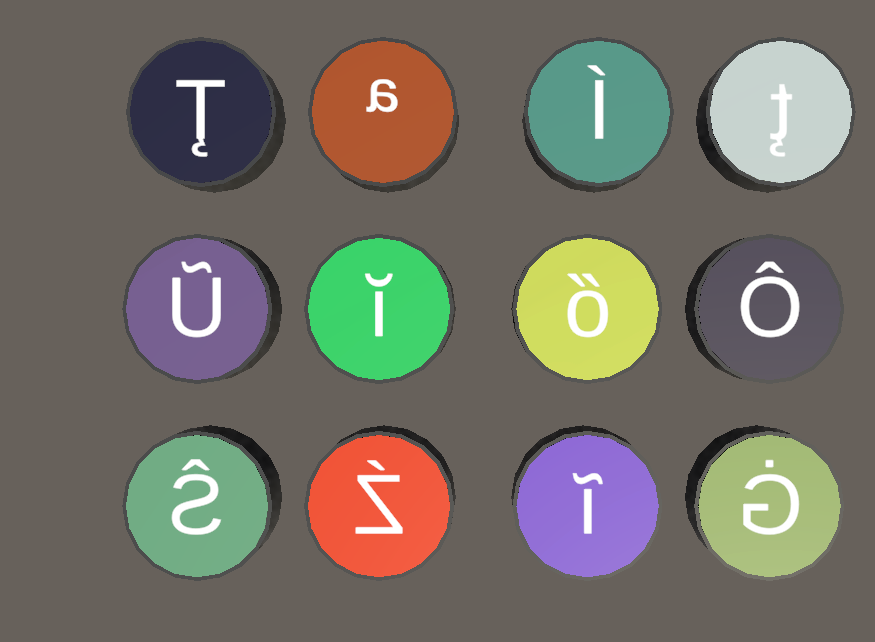

The only downside is that Unicode emoji fonts are not always open source.

If you want complete control over your assets, you'll need to create your own image library or font.

For example, you can use **FontForge** to create or edit fonts:

[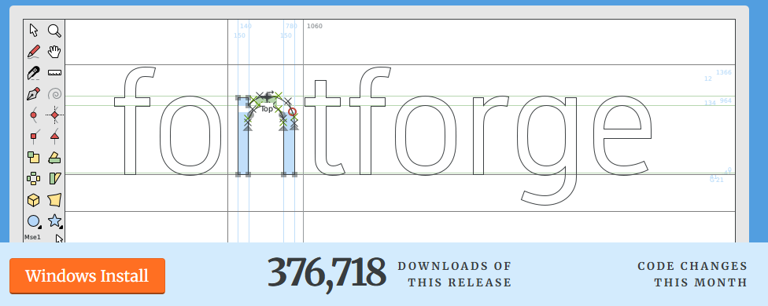](https://fontforge.org/en-US/)
https://fontforge.org/en-US/

Or you can start from an open-source font project on GitHub, such as **Noto Emoji**:

[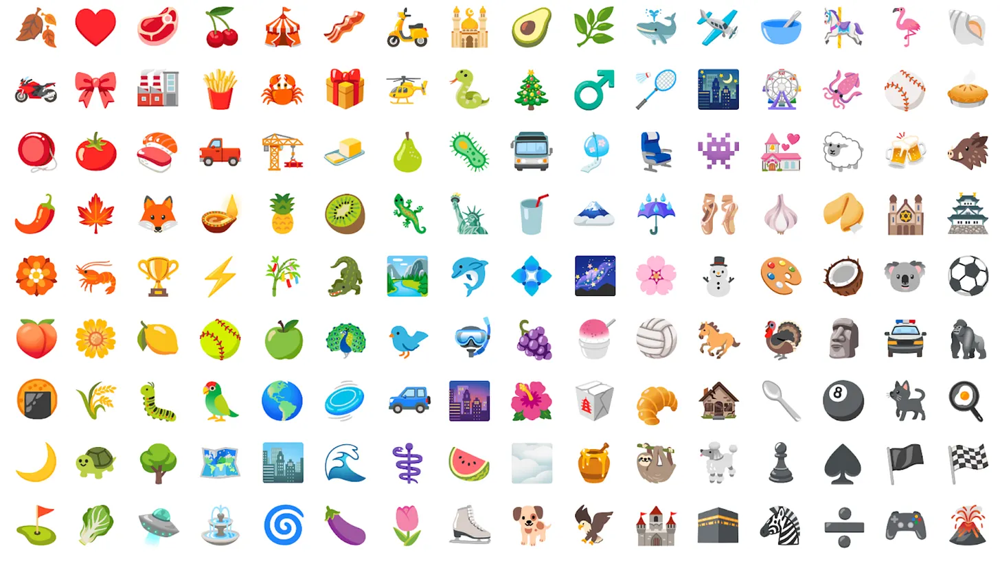](https://github.com/googlefonts/noto-emoji)
https://github.com/googlefonts/noto-emoji

To use a font with **TextMesh Pro**, you first need to convert it into a TextMesh Pro Font Asset.

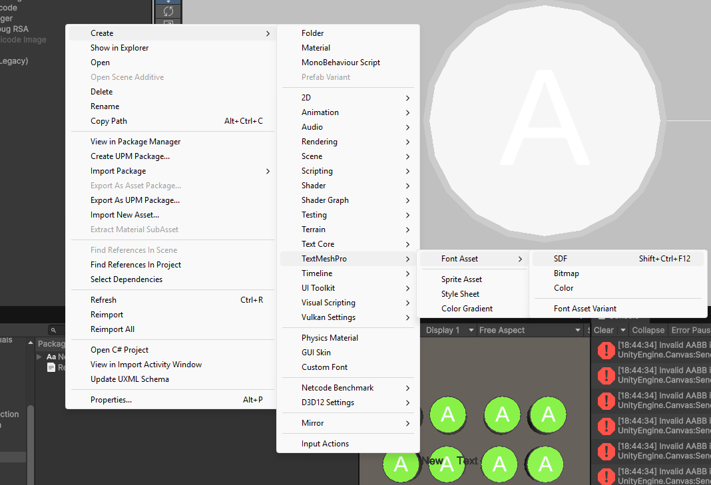

The generated asset looks something like this:

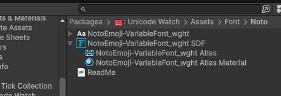

Once assigned to a TextMesh Pro text component, you'll get something like this. 😉

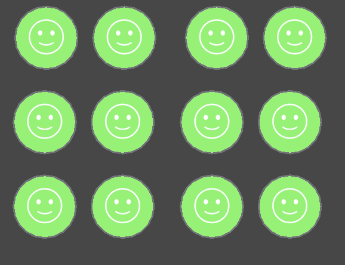

---

Now let's imagine we're building a game for a class of 12 students.

We'll need a manager that can update a specific player's watch—for example, **Player 5**, **Player 56**, or the player associated with a particular RSA public key.

Without going into all the implementation details, the API could look something like this:


```cs 
    public class UnicodeWatchMono_WatchGroupManager : MonoBehaviour
    {
        #region SINGLETON
        private static UnicodeWatchMono_WatchGroupManager m_watchManagerInScene;
        public static UnicodeWatchMono_WatchGroupManager GetManagerInScene()
        {
            return m_watchManagerInScene;
        }
        public void OnEnable()
        {
            m_watchManagerInScene = this;
        }
        #endregion
        public List<UnicodeWatchMono_Facade> m_watchGroupFacade = new List<UnicodeWatchMono_Facade>();
        public List<UnicodeWatchMono_IndexAndRSA> m_watchGroupIndex = new List<UnicodeWatchMono_IndexAndRSA>();


        public void SetClaimIndexAtPlayerInList(int indexInList, int claimIndex)
        {
            if (indexInList < 0 || indexInList >= m_watchGroupIndex.Count)
                return;
            m_watchGroupIndex[indexInList].SetPlayerIntIndex(claimIndex);
        }
        public void SetPublicKeyAtPlayerInList(int indexInList, string publicKey)
        {
            if (indexInList < 0 || indexInList >= m_watchGroupIndex.Count)
                return;
            m_watchGroupIndex[indexInList].SetPlayerPublicKey(publicKey);
        }
        public void GetListOfClaimIndex(out List<int> claimIndexList)
        {
            claimIndexList = new List<int>();
            for (int i = 0; i < m_watchGroupIndex.Count; i++)
            {
                m_watchGroupIndex[i].GetPlayerIntIndex(out int index);
                claimIndexList.Add(index);
            }
        }
        public void GetListOfPublicKey(out List<string> publicKeyList)
        {
            publicKeyList = new List<string>();
            for (int i = 0; i < m_watchGroupIndex.Count; i++)
            {
                m_watchGroupIndex[i].GetPlayerPublicKey(out string key);
                publicKeyList.Add(key);
            }
        }

        public void GetPlayerByListIndex(int playerIndex, out UnicodeWatchMono_Facade watch)
        {
            watch = null;
            if (playerIndex < 0 || playerIndex >= m_watchGroupFacade.Count)
                return;
            watch = m_watchGroupFacade[playerIndex];
        }

        public void GetPlayerByClaimIndex(int playerClaimIndex, out UnicodeWatchMono_Facade watch)
        {
            watch = null;
            for (int i = 0; i < m_watchGroupIndex.Count; i++)
            {
                m_watchGroupIndex[i].GetPlayerIntIndex(out int index);
                if (index == playerClaimIndex)
                {
                    GetPlayerByListIndex(i, out watch);
                    return;
                }
            }
        }
        public void GetPlayerByPublicKey(string publicKey, out UnicodeWatchMono_Facade watch)
        {
            watch = null;
            for (int i = 0; i < m_watchGroupIndex.Count; i++)
            {
                m_watchGroupIndex[i].GetPlayerPublicKey(out string key);
                if (key == publicKey)
                {
                    GetPlayerByListIndex(i, out watch);
                    return;
                }
            }
        }

        public void SetColorUsingPlayerIndex(int playerIndex, Color color)
        {
            GetPlayerByClaimIndex(playerIndex, out UnicodeWatchMono_Facade watch);
            if (watch != null)
                watch.SetWatchWithColor(color);
        }
        public void SetUnicodeUsingPlayerIndex(int playerIndex, string unicode)
        {
            GetPlayerByClaimIndex(playerIndex, out UnicodeWatchMono_Facade watch);
            if (watch != null)
                watch.SetWatchWithUnicode(unicode);
        }
        public void SetColorUsingPublicKey(string publicKey, Color color)
        {
            GetPlayerByPublicKey(publicKey, out UnicodeWatchMono_Facade watch);
            if (watch != null)
                watch.SetWatchWithColor(color);
        }
        public void SetUnicodeUsingPublicKey(string publicKey, string unicode)
        {
            GetPlayerByPublicKey(publicKey, out UnicodeWatchMono_Facade watch);
            if (watch != null)
                watch.SetWatchWithUnicode(unicode);
        }
        public void SetColorUsingListIndex(int listIndex, Color color)
        {
            GetPlayerByListIndex(listIndex, out UnicodeWatchMono_Facade watch);
            if (watch != null)
                watch.SetWatchWithColor(color);
        }
        public void SetUnicodeUsingListIndex(int listIndex, string unicode)
        {
            GetPlayerByListIndex(listIndex, out UnicodeWatchMono_Facade watch);
            if (watch != null)
                watch.SetWatchWithUnicode(unicode);
        }
    }
```


And since we're lazy developers, with a small singleton we will be able to update them directly from our Mirror code.

This way, the network layer can easily change a player's watch remotely without needing to know how the watch is implemented internally.


```cs
  public class UnicodeWatch_WatchGroupManagerStatic {

      #region SET COLOR WITH STATIC SINGLETON
      public static void SetColorUsingPlayerIndex(int playerIndex, Color color)
      {
          UnicodeWatchMono_WatchGroupManager.GetManagerInScene()?.SetColorUsingPlayerIndex(playerIndex, color);
      }
      public static void SetColorUsingPublicKey(string publicKey, Color color)
      {
          UnicodeWatchMono_WatchGroupManager.GetManagerInScene()?.SetColorUsingPublicKey(publicKey, color);
      }
      public static void SetColorUsingListIndex(int listIndex, Color color)
      {
          UnicodeWatchMono_WatchGroupManager.GetManagerInScene()?.SetColorUsingListIndex(listIndex, color);
      }
      #endregion

      #region SET UNICODE WITH STATIC SINGLETON
      public static void SetUnicodeUsingPlayerIndex(int playerIndex, string unicode)
      {
          UnicodeWatchMono_WatchGroupManager.GetManagerInScene()?.SetUnicodeUsingPlayerIndex(playerIndex, unicode);
      }
      public static void SetUnicodeUsingPublicKey(string publicKey, string unicode)
      {
          UnicodeWatchMono_WatchGroupManager.GetManagerInScene()?.SetUnicodeUsingPublicKey(publicKey, unicode);
      }
      public static void SetUnicodeUsingListIndex(int listIndex, string unicode)
      {
          UnicodeWatchMono_WatchGroupManager.GetManagerInScene()?.SetUnicodeUsingListIndex(listIndex, unicode);
      }
      #endregion

      #region SET INDEX AND PUBLIC KEY WITH STATIC SINGLETON
      public static void SetClaimIndexAtPlayerInList(int indexInList, int claimIndex)
      {
          UnicodeWatchMono_WatchGroupManager.GetManagerInScene()?.SetClaimIndexAtPlayerInList(indexInList, claimIndex);
      }
      public static void SetPublicKeyAtPlayerInList(int indexInList, string publicKey)
      {
          UnicodeWatchMono_WatchGroupManager.GetManagerInScene()?.SetPublicKeyAtPlayerInList(indexInList, publicKey);
      }
      #endregion

  }
```


I still need to discuss with you how we should move them around...   
But that will be for another time.   

For now, let's first test if everything is working correctly.   

--------

Let's add the prefabs to the Pool Manager.

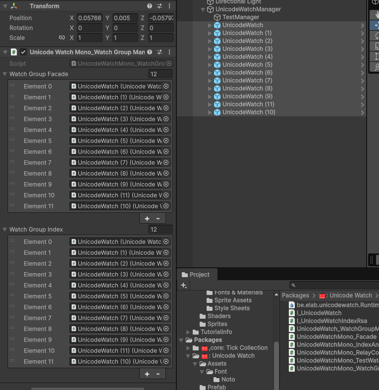

Now let's create a small test script for the manager.

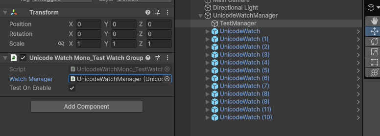

Let's create a simple script to test all of this.


```cs
 public class UnicodeWatchMono_TestWatchGroupManager : MonoBehaviour
{
    public UnicodeWatchMono_WatchGroupManager m_watchManager;
    public bool m_testOnEnable = true;

    public int playerCount = 12;
    public string[] m_unicodes = new string[12] { "😀", "😁", "😂", "🤣", "😃", "😄", "😅", "😆", "😉", "😊", "😋", "😎" };
    public Color[] m_colors = new Color[12] { Color.red, Color.green, Color.blue, Color.yellow, Color.cyan, Color.magenta, Color.gray, Color.white, Color.black, Color.clear, Color.grey, Color.Lerp(Color.red, Color.blue, 0.5f) };
    public int []m_claimIndex = new int[12] { 1, 2, 3, 4, 5, 6, 7, 8, 9, 10, 11, 12 };
    public string[] m_publicKeys = new string[12];
    [Header("Dont expose private key in real project")]
    public string[] m_privateKeys = new string[12];


    [ContextMenu("Create a public key for each player")]
    public void CreateRandomPublicKeyForTesting()
    {
        for (int i = 0; i < playerCount; i++)
        {
            GeneratePublicKeyRsa(out string publicKey, out string privateKey);
            m_publicKeys[i] = publicKey;
            m_privateKeys[i] = privateKey;
        }
    }

    private void OnEnable()
    {
        if (m_testOnEnable)
            TestWithInspectorValue();
    }
    [ContextMenu("Test Inpsector Value")]   
    public void TestWithInspectorValue() {

        for (int i = 0;i < playerCount; i++) { 
        
            m_watchManager.SetClaimIndexAtPlayerInList(i, m_claimIndex[i]);
            m_watchManager.SetPublicKeyAtPlayerInList(i, m_publicKeys[i]);
            m_watchManager.SetColorUsingPublicKey(m_publicKeys[i], m_colors[i]);
            m_watchManager.SetUnicodeUsingPublicKey(m_publicKeys[i], m_unicodes[i]);
            m_watchManager.SetColorUsingPlayerIndex(m_claimIndex[i], m_colors[i]);
        }
    }

    public void GeneratePublicKeyRsa(out string publicKey, out string privateKey)
    {
        using (var rsa = new System.Security.Cryptography.RSACryptoServiceProvider(512))
        {
            try
            {
                publicKey = rsa.ToXmlString(false);
                privateKey = rsa.ToXmlString(true);
            }
            finally
            {
                rsa.PersistKeyInCsp = false;
            }
        }
    }

    public void GetUnicodeFromDecimal(int decimalValue, out string unicode)
    {
        unicode = char.ConvertFromUtf32(decimalValue);
    }
}
 ```
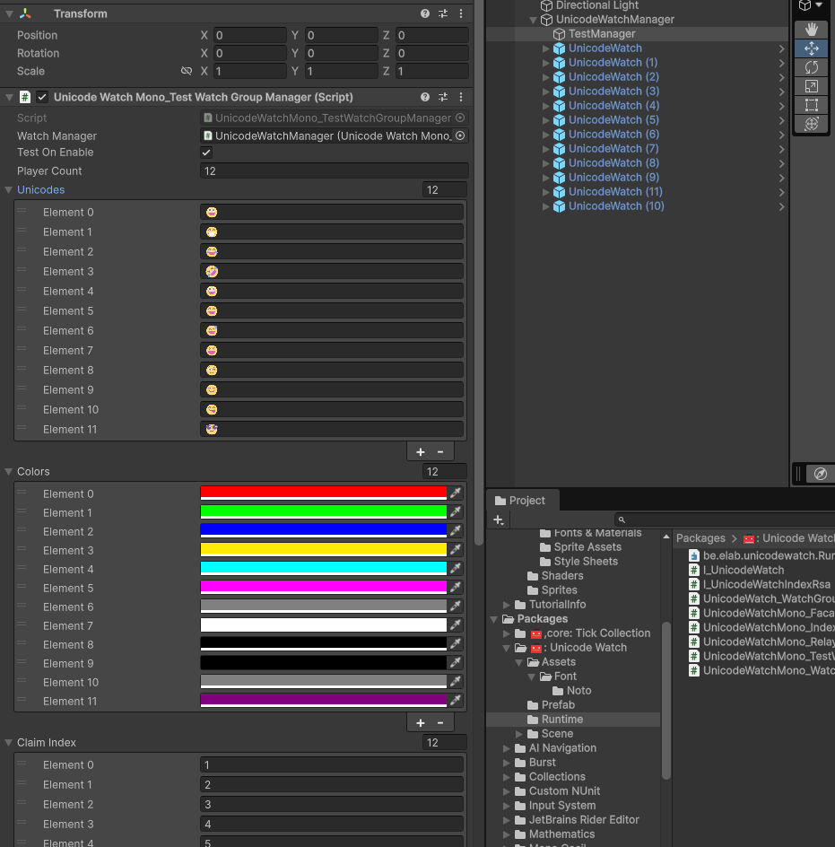
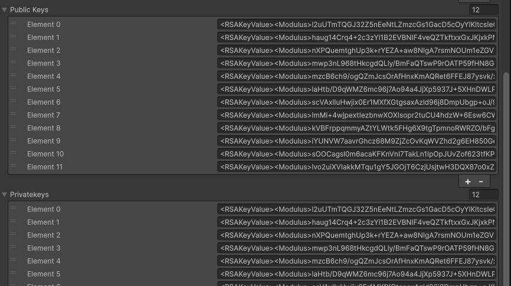

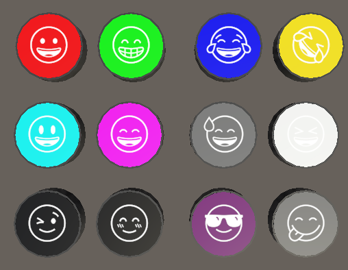

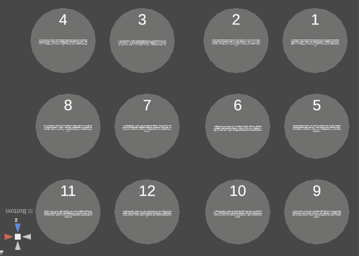


-------

If you want to have fun.

```cs
  public class UnicodeWatchMono_TextToSound : MonoBehaviour
  {
      [System.Serializable]
      public class TextToSoundEvent { 
      
          public string [] m_text;
          public AudioClip m_sound;
      }

      public UnityEvent<AudioClip> m_onSoundToPlay;
      public TextToSoundEvent[] m_textToSound=new TextToSoundEvent[] { 
          new TextToSoundEvent() { m_text = new string[] { "??", "??" }, m_sound = null },
          new TextToSoundEvent() { m_text = new string[] { "??","?????", "???" }, m_sound = null },
      };

      public void TryToPlayUnicode(string unicode)
      {
          for (int i = 0; i < m_textToSound.Length; i++)
          {
              if (System.Array.Exists(m_textToSound[i].m_text, element => element == unicode))
              {
                  m_onSoundToPlay.Invoke(m_textToSound[i].m_sound);
                  return;
              }
          }
      }

  }
  ```