I have a video explaining how to use Mirror and RSA.

[https://github.com/EloiStree/HelloUnityMirror/tree/main/video/mirror_and_rsa_workflow](https://github.com/EloiStree/HelloUnityMirror/tree/main/video/mirror_and_rsa_workflow)

However, I'm not sure this is the topic you want to learn.

Today we will learn about **`[Command]`** and **`[SyncVar]`**.

The goal is to let a player declare:

* their integer ID,
* their public key,
* their color (once their integer ID or public key has been defined).

We won't perform any identity verification yet.

---

## Requirements

* A Unity project with **Mirror** installed.
* The package:

  * [https://github.com/EloiStree/2026_07_21_upm_unicode_watch_for_vr](https://github.com/EloiStree/2026_07_21_upm_unicode_watch_for_vr)

---

# Creating a Simple Lobby

Our goal is to create a player that can:

* choose who they want to be,
* verify their identity later,
* send a Unicode character,
* choose a color.

To do that, we first need a lobby.

Since the lobby is hosted by one of the players, that player is called the **Host**.

The Host is both:

* a **client** playing the game,
* the **server** for every other player.

To keep things simple, we'll reuse the basic lobby scene that comes with Mirror.

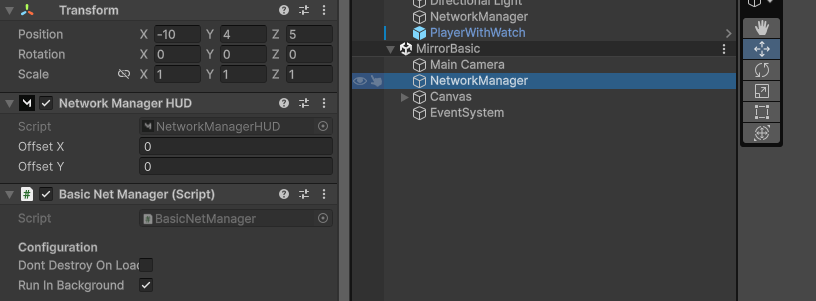

Copy it into your project, then close the original scene **without saving**.

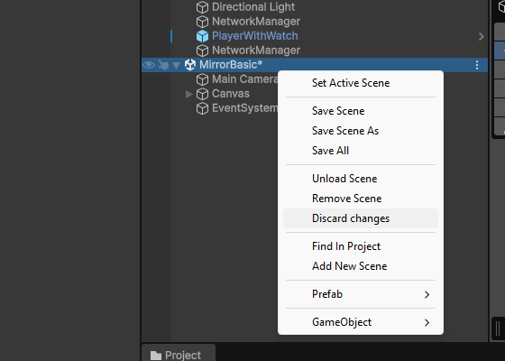

---

The **Network Manager HUD** is useful for debugging while prototyping.

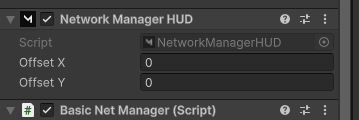

For example, you can:

* start as a Host,
* start as a Client,
* change the server IP that the client connects to.

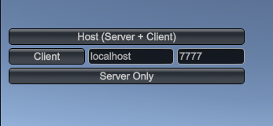

---

Under the **NetworkManager**, you'll find the **KCP Transport**.

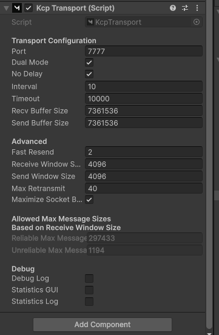

This component handles the network communication (UDP-based transport).

---

The **Network Manager** also expects a **Player Prefab**.

For a GameObject to exist on the network, it must contain a **NetworkIdentity** component.

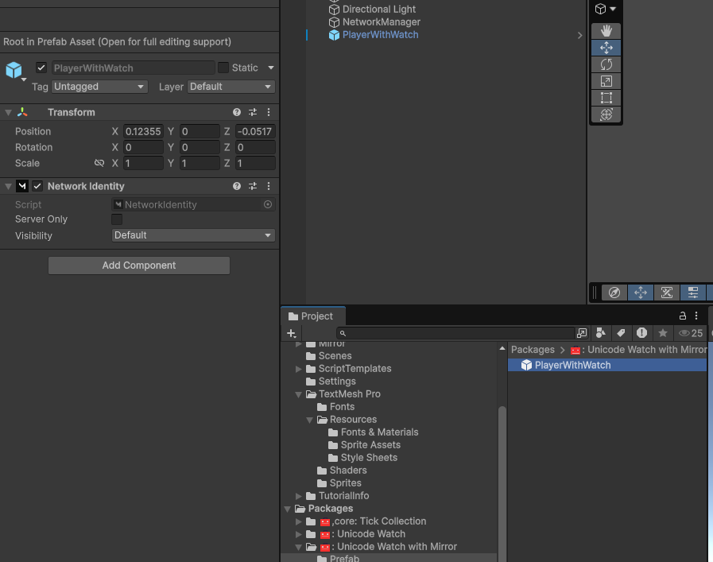

Assign your player prefab to the Network Manager.

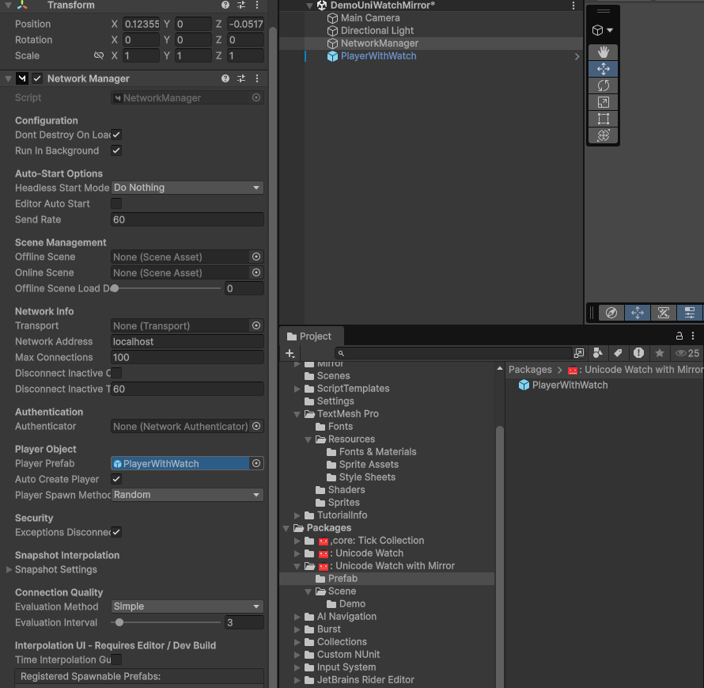

---

When you start the game, a player is automatically spawned.

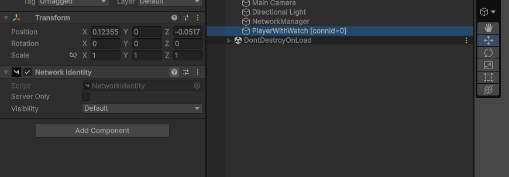

Notice that the first player is both the **Client** and the **Server**.

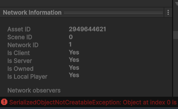

---

## Creating a Network Script

Create a new script (and Assembly Definition if needed) that references Mirror.

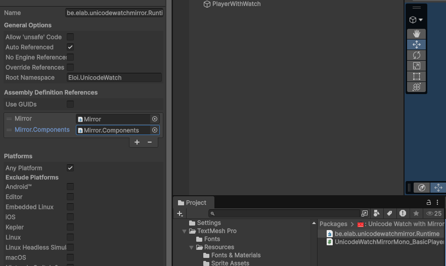

To create a network behaviour, your class must inherit from **NetworkBehaviour**.

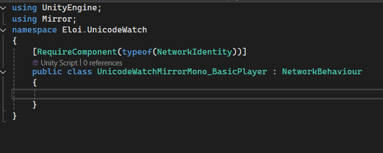

---

## Asking the Server to Change the Color

Let's allow the player to request a new random color.

```cs
[ContextMenu("Set New Random Color")]
public void SetNewRandomColor()
{
    Color c = new Color(Random.value, Random.value, Random.value);
    CmdSetColor(c);
}
```

The player asks the server using a **`[Command]`**.

In other words:

> "Server, I'd like my player to use this color."

```cs
[Command]
private void CmdSetColor(Color c)
{
    RpcSetColor(c);
}
```

The server then replies with a **ClientRpc**, telling every connected client about the new color.

We use a UnityEvent so designers can react to the color change without writing code.

```cs
public UnityEvent<Color> m_onColorChanged;

[ClientRpc]
private void RpcSetColor(Color c)
{
    m_onColorChanged?.Invoke(c);
}
```

The communication flow is:

**Client → `[Command]` → Server → `[ClientRpc]` → All Clients**

---

## Testing

Create a cube and add a **`UnicodeWatchMono_RelayColor`** component.

Connect the mesh renderer and the UnityEvent.

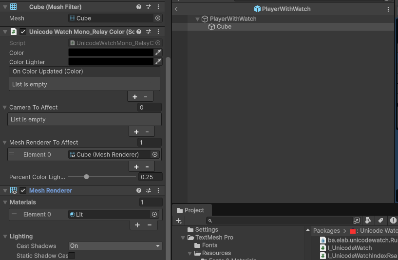

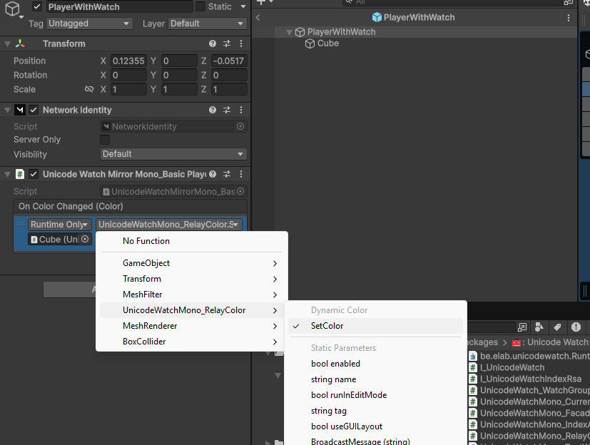

If everything works in the Editor, test it with a standalone build.

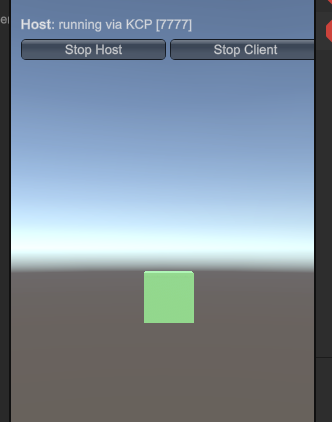

---

## Giving Players Random Positions

Let's randomly move the player for debugging.

```cs
public float m_randomSpotAtStart = 5f;

private void Start()
{
    transform.position = new Vector3(
        Random.Range(0f, m_randomSpotAtStart),
        Random.Range(0f, m_randomSpotAtStart),
        Random.Range(0f, m_randomSpotAtStart));
}
```

To make it easier to see the result, arrange the game windows like this.

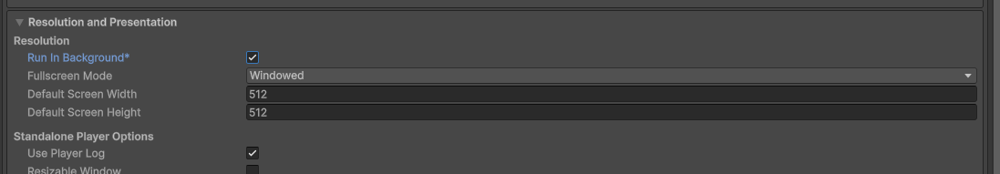

The standalone build is acting as the server.

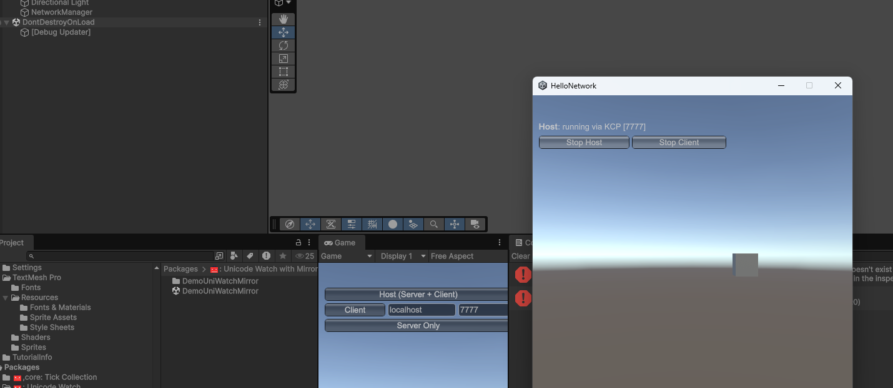

Find the player that belongs to you and change its color.

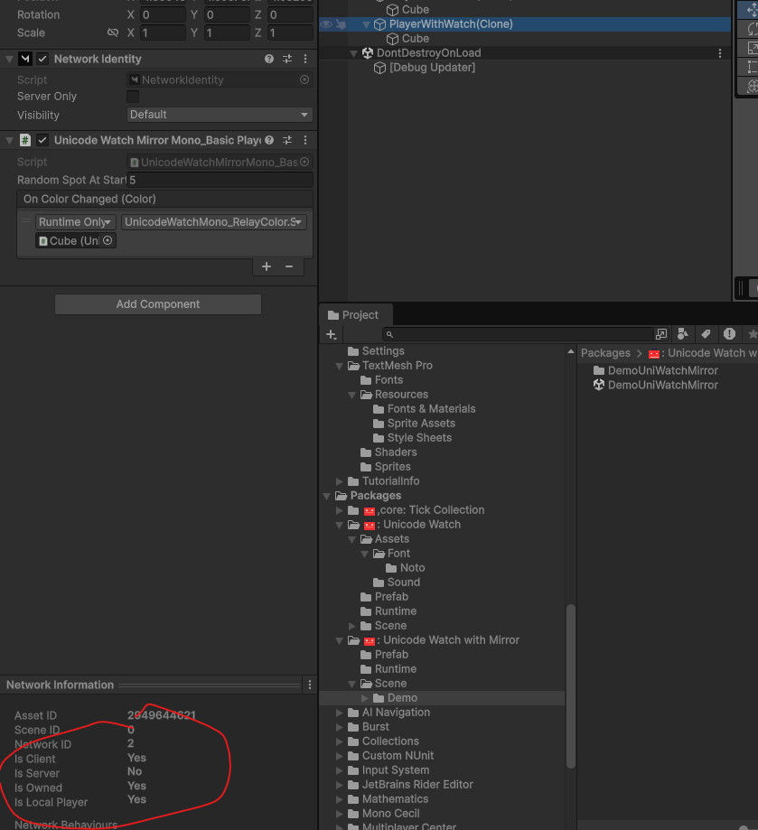

Tada! It works.

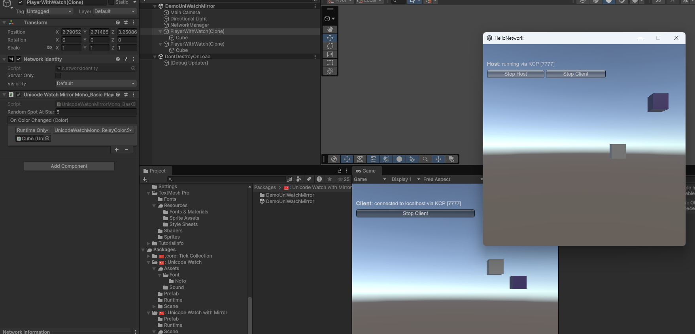

---

## Why Doesn't the Position Match?

The cube position is random, but every client sees a different position.

That's because we never synchronized the position with the other players.

You could synchronize it the same way we synchronized the color.

However, Mirror already provides a solution:

**NetworkTransform**

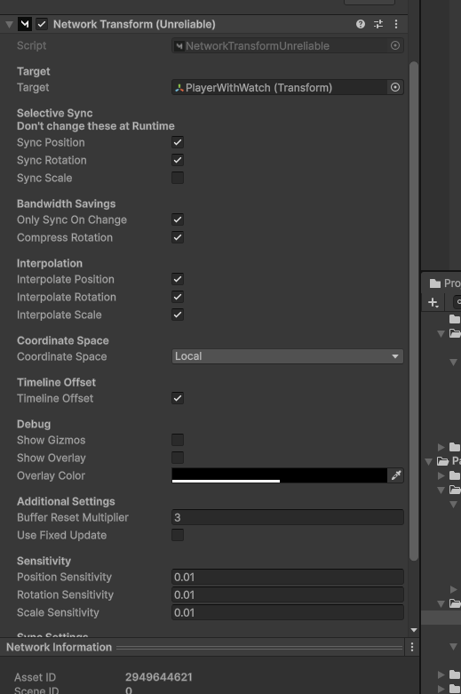

Unfortunately, we moved the object **before** the networking system had finished spawning it.

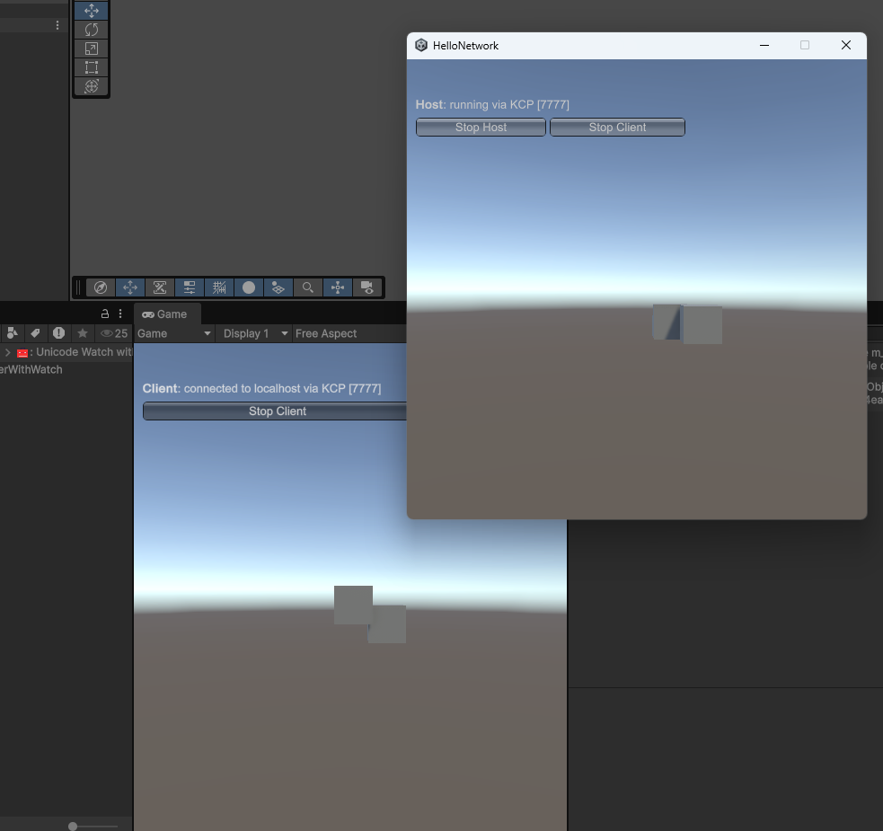

Instead, move it after it has joined the network.

```cs
public float m_randomSpotAtStart = 2f;

public override void OnStartClient()
{
    base.OnStartClient();

    if (!isOwned)
        return;

    transform.position = new Vector3(
        Random.Range(0f, m_randomSpotAtStart),
        Random.Range(0f, m_randomSpotAtStart),
        Random.Range(0f, m_randomSpotAtStart));
}
```

Be careful to move the object **only if you own it**.

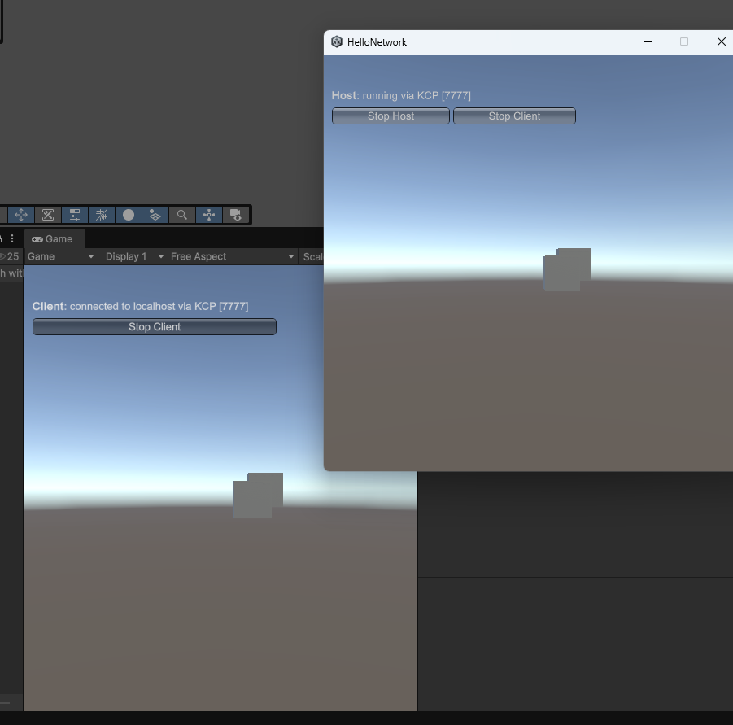

---

# The Problem with ClientRpc

Suppose a new player joins the game later.

They never received the earlier `ClientRpc`, so they don't know what color the existing players are.

This is exactly why **`[SyncVar]`** exists.

A `SyncVar` automatically synchronizes the current value to newly connected clients, ensuring everyone sees the correct state even if they join after the change occurred.
